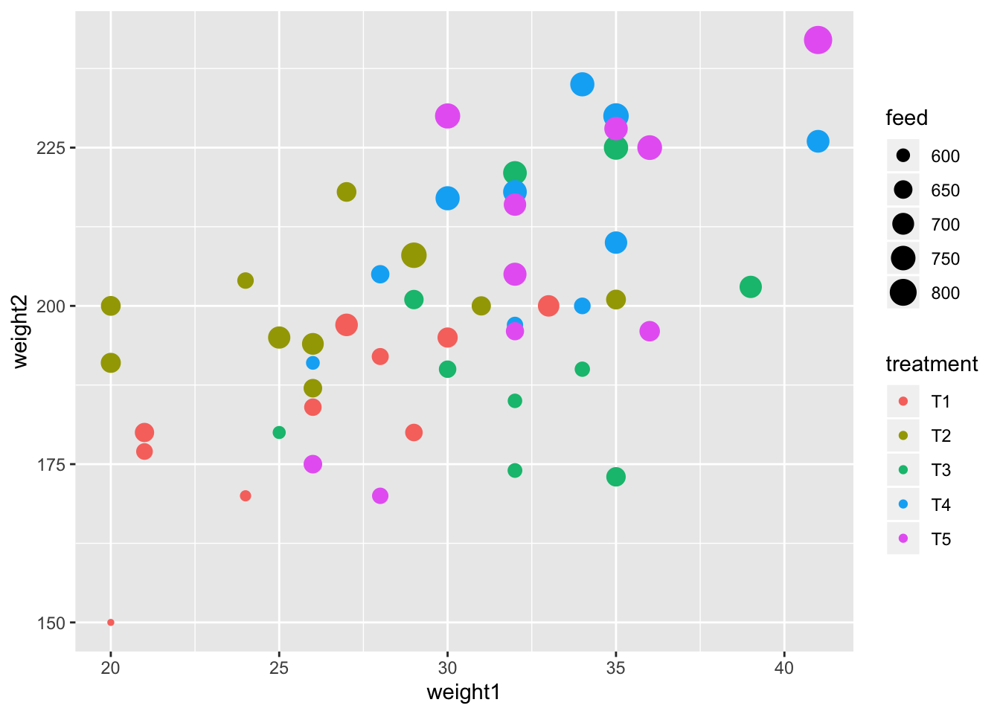
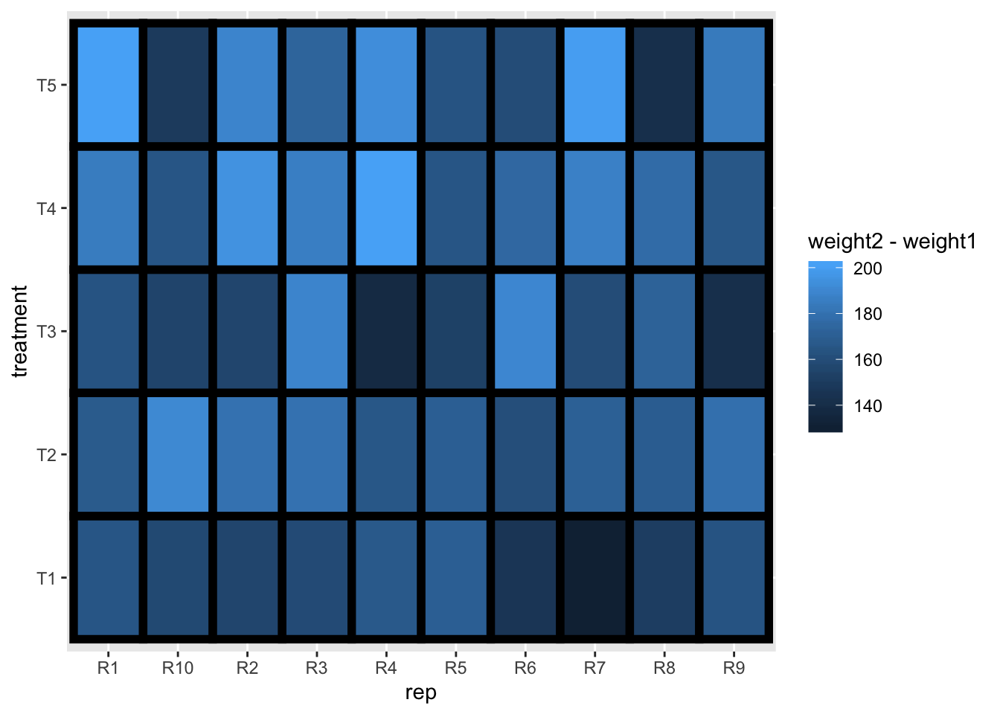
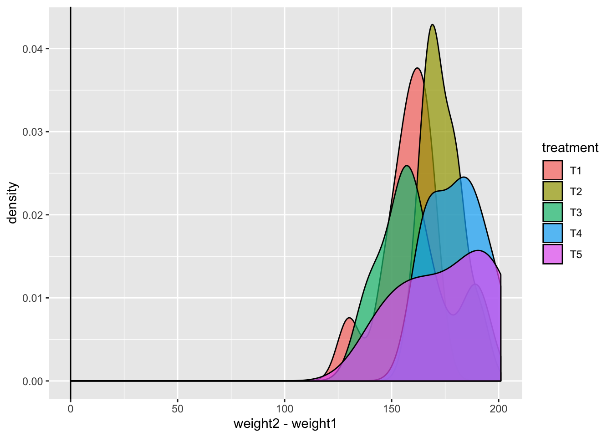
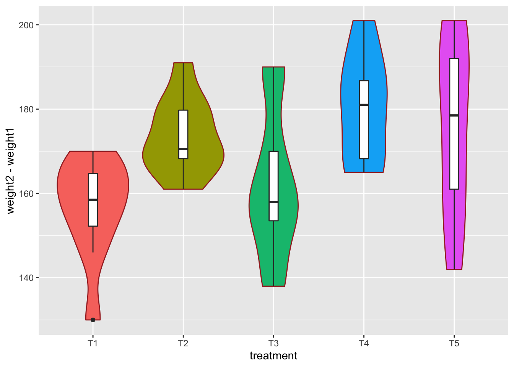
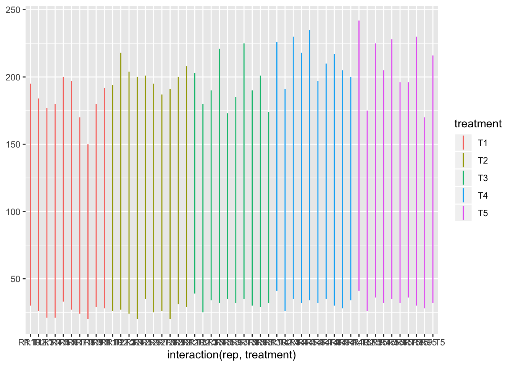
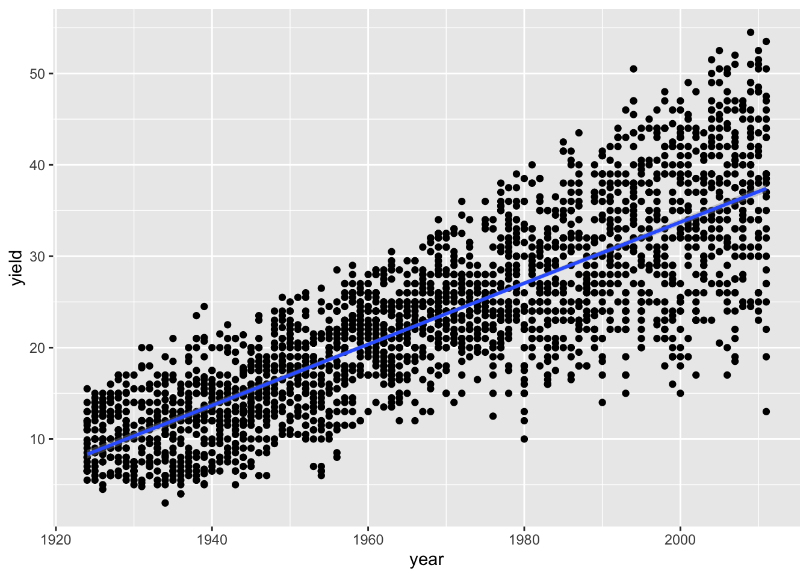
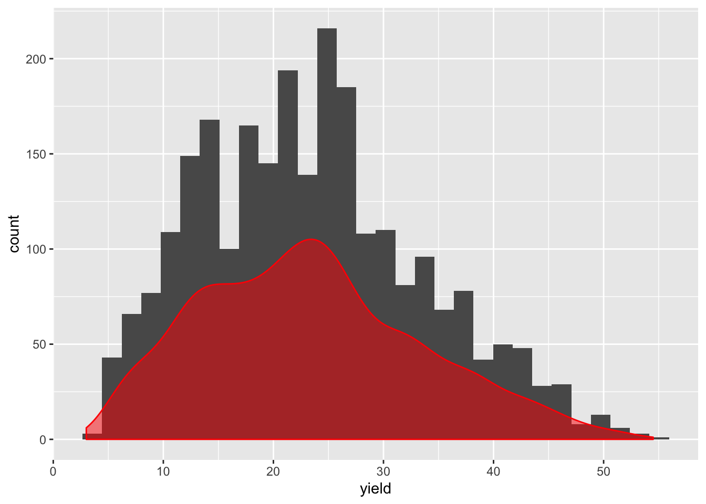
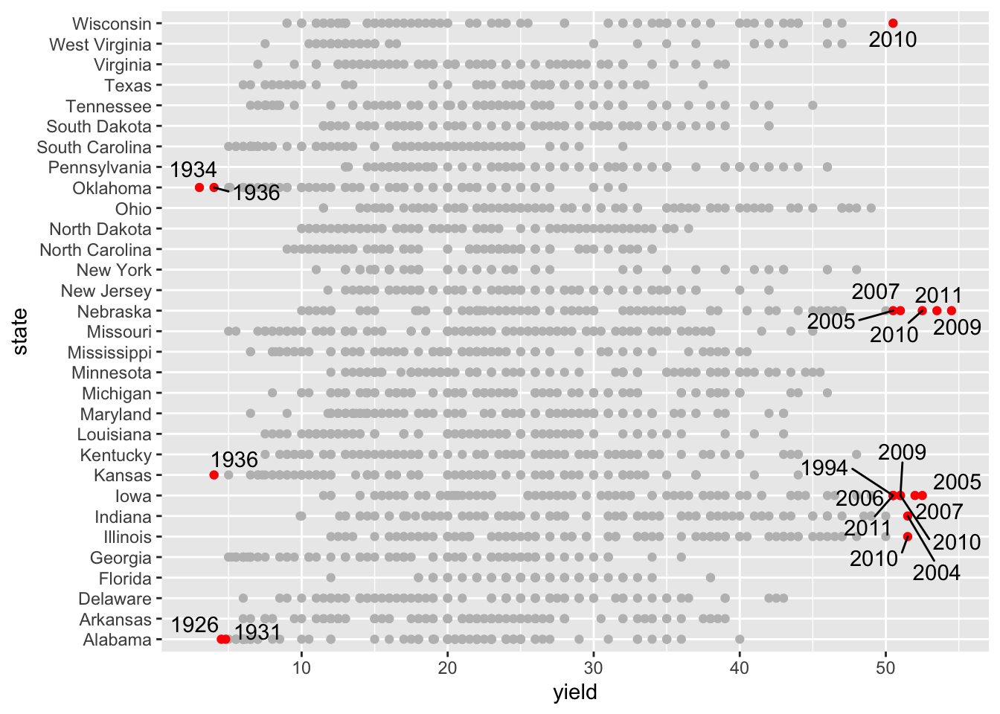

---
output:
  html_document:
    toc: true
    toc_float: true
---

# Challenge: Recreate the ggplots

Push the `knit` button!

```{r setup, include = F}
library(tidyverse)
library(agridat)
library(ggrepel)
```

## `crampton.pig` dataset

```{r}
glimpse(crampton.pig)
```


### Exercise 1: Blank 

```{r exercise-01, echo = F}
knitr::include_graphics("challenge01/exercise-01-1.png")
```

```{r exercise-01s}
# add your code here!
```

### Exercise 2: Scatterplot

```{r exercise-02, echo = F}

```

```{r exercise-02s}
# add your code here!
```

### Exercise 3: Tile

```{r exercise-03, echo = F}

```

```{r exercise-03s}
# add your code here!
```

### Exercise 4: Density and Transparency

```{r exercise-04, echo = F}

```

```{r exercise-04s}
# add your code here!
```

### Exercise 5: Tile

```{r exercise-05, echo = F}

```

```{r exercise-05s}
# add your code here!
```

### Exercise 6: Line Range

```{r exercise-06, echo = F}

```

```{r exercise-06s}
# add your code here!
```

## `nass.soybean` dataset

```{r}
glimpse(nass.soybean)
```


### Exercise 7: Line

```{r exercise-07, echo = F}

```

```{r exercise-07s}
# add your code here!
```

### Exercise 8: Hex plot

```{r exercise-08, echo = F}
knitr::include_graphics("challenge01/exercise-08-1.png")
```

```{r exercise-08s}
# add your code here!
```

### Exercise 9: Density

```{r exercise-09, echo = F}

```

```{r exercise-09s}
# add your code here!
```

### Exercise 10: Labels

```{r exercise-10, echo = F}

```

Hint: have a look at `geom_text_repel`

```{r exercise-10s}
edgeyields <- subset(nass.soybean, yield < 5 | yield > 50)
# add your code here!
```
