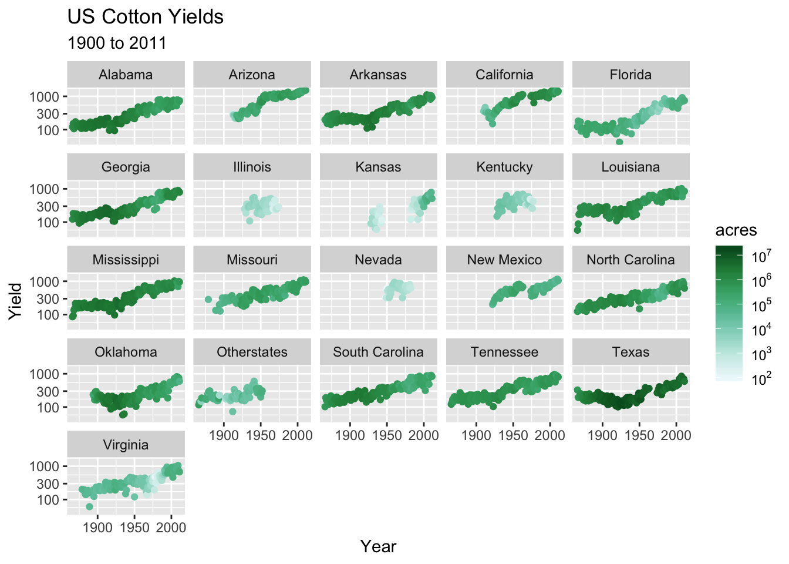
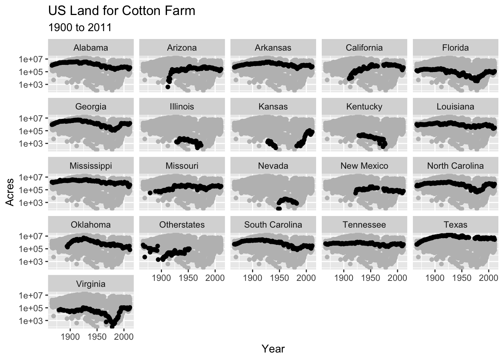
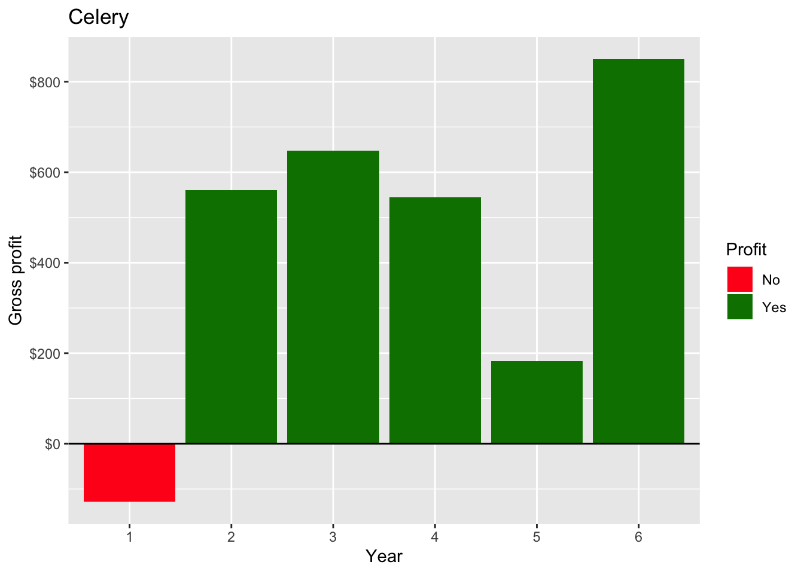
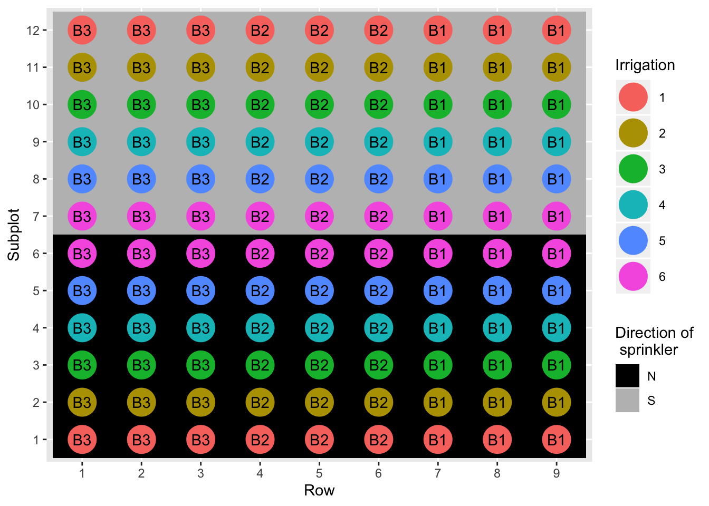
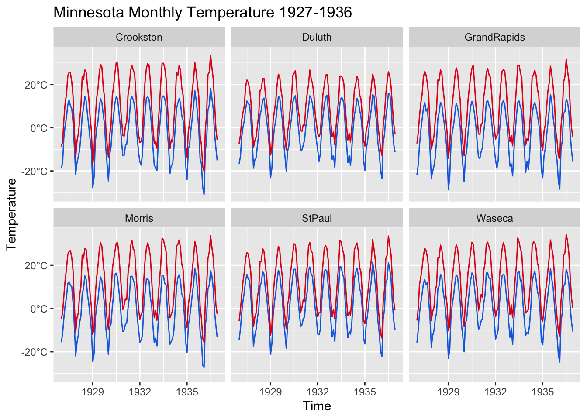

---
output:
  html_document:
    toc: true
    toc_float: true
---

```{r setup, include = FALSE}
library(tidyverse)
library(agridat)
library(scales)
```

Modify the scales to match the pictures.

# Exercise 1

```{r}
glimpse(nass.cotton)
```

Hint: `scale_color_distiller` and `scale_y_log10`

```{r exercise-01, echo = FALSE}

```


```{r exercise-01s}
ggplot(nass.cotton, aes(year, yield)) + 
  geom_point(aes(color = acres)) + 
  facet_wrap(~state) # add your scale here!
```

# Exercise 2

```{r exercise-02, echo = FALSE}

```


Hint: `labs` and `scale_y_log10`

```{r exercise-02s}
# drop the state so it doesn't get facet wrapped
shadow_dat <- nass.cotton
shadow_dat$state <- NULL
ggplot(nass.cotton, aes(year, acres)) +
  geom_point(data = shadow_dat, color = "gray") +
  geom_point() +
  facet_wrap(~state) # add your scale here!
```

# Exercise 3

```{r exercise-03, echo = FALSE}

```

```{r}
glimpse(hazell.vegetables)
```

Hint: `scale_y_continuous`, `labs`, `scale_fill_manual`, `scale_x_discrete`

```{r exercise-03s}
ggplot(hazell.vegetables, aes(year, celery, fill = celery > 0)) + 
  geom_col() + 
  geom_hline(yintercept = 0) # add your scale here!
```

# Exercise 4

```{r exercise-04, echo = FALSE}

```

```{r}
glimpse(hanks.sprinkler)
```

Hint: `scale_fill_manual`, `labs` and `guides` to change order

```{r exercise-04s}
ggplot(hanks.sprinkler, aes(factor(row), factor(subplot))) +
  geom_tile(aes(fill = dir)) +
  geom_point(aes(color = factor(irr)), size = 9) +
  geom_text(aes(label = block)) # add your scale here!
```

# Exercise 5

```{r exercise-05, echo = FALSE}

```

```{r}
glimpse(minnesota.barley.weather)
```

Hint: `scale_y_continuous`, `scale_x_date`, `labs` or `ggtitle`

```{r exercise-05s}
minnesota.barley.weather$date <- with(minnesota.barley.weather, 
                                      as.Date(paste(year, mo, "01", sep = "-")))


farenheight_to_celsius <- function(x) return((x - 32) * 5/9) 
ggplot(minnesota.barley.weather, aes(x = date)) + 
  geom_line(aes(y = farenheight_to_celsius(min)), color = "#166ee0") + 
  geom_line(aes(y = farenheight_to_celsius(max)), color = "#e0161d")  + 
  facet_wrap(~site) # add your scale here!
```


