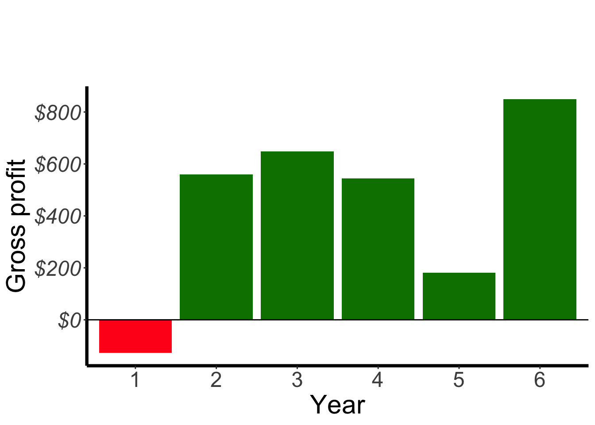
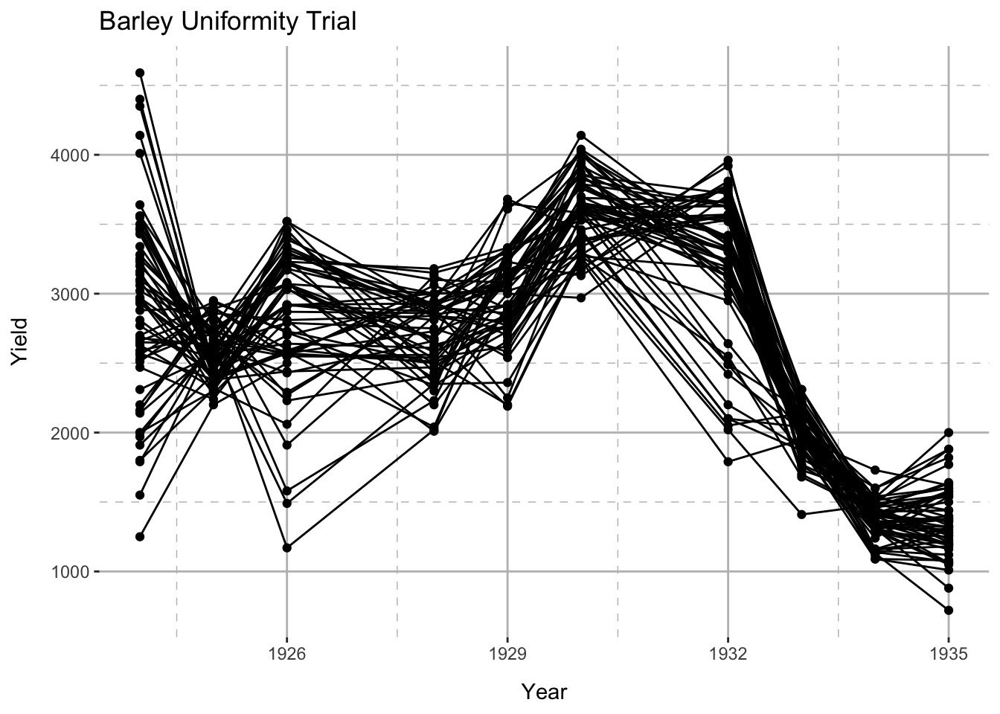
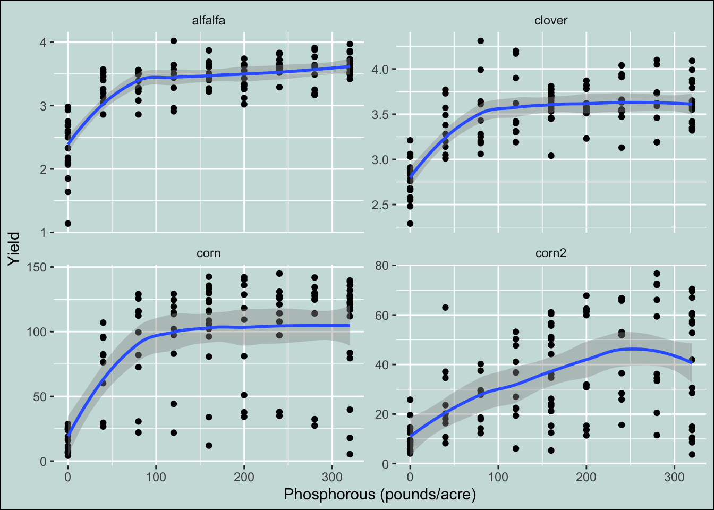
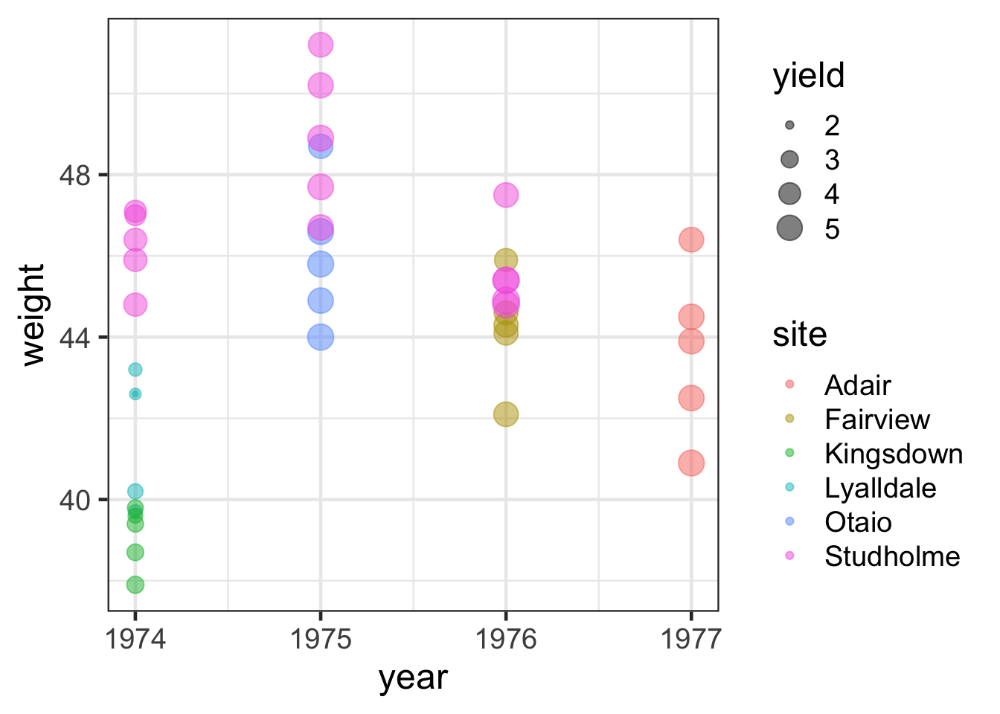
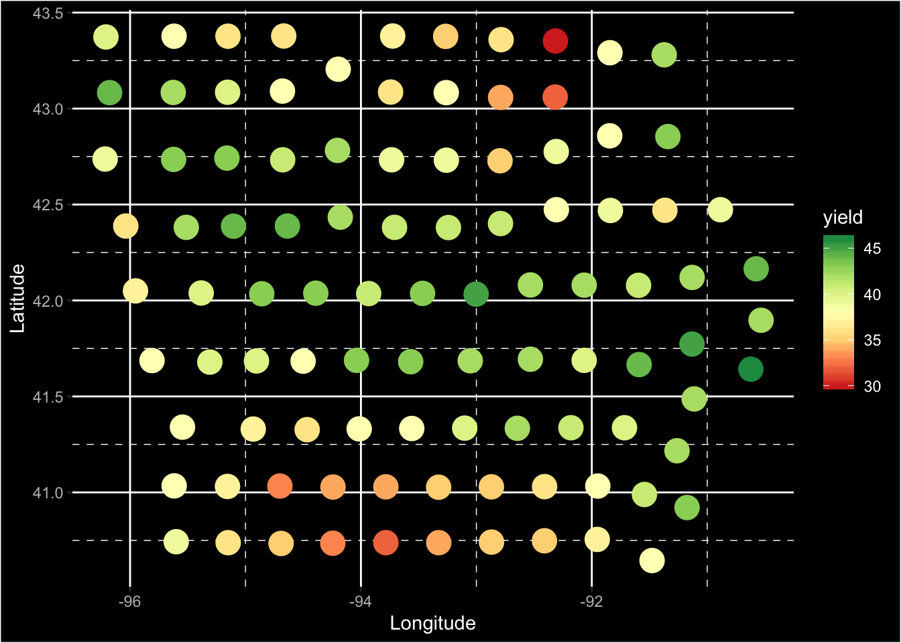

---
output:
  html_document:
    toc: true
    toc_float: true
---

```{r setup, include = FALSE}
library(tidyverse)
library(agridat)
library(scales)
```

# Exercise 1

```{r exercise-01}

```


```{r exercise-01s}
ggplot(hazell.vegetables, aes(year, celery, fill = celery > 0)) + 
  geom_col(show.legend = FALSE) + 
  geom_hline(yintercept = 0) + 
  scale_y_continuous(labels = dollar) + 
  labs(y = "Gross profit", x = "Year",
       title = "Celery", fill = "Profit") +
  scale_fill_manual(values = c("#ff1a1a", "#008000")) +
  scale_x_discrete(labels = 1:6) 
```

# Exercise 2

```{r exercise-02}

```


```{r exercise-02s}
ggplot(baker.barley.uniformity, aes(year, yield, group = interaction(row, col))) + 
  geom_point() + 
  geom_line() + 
  labs(y = "Yield", x = "Year", title = "Barley Uniformity Trial") 
```

# Exercise 3

```{r exercise-03}

```


```{r exercise-03s}
ggplot(heady.fertilizer, aes(P, yield)) +
geom_point() + facet_wrap(~crop, scale = "free_y") + 
  geom_smooth() + 
  labs(x = "Phosphorous (pounds/acre)",
       y = "Yield"
       ) 
```

# Exercise 4

```{r exercise-04}

```

Hint: have a look at `theme_bw`

```{r exercise-04s}
ggplot(mcleod.barley, aes(year, weight, color = site, size = yield)) + 
  geom_point(alpha = 1/2) 
```

# Exercise 5

```{r exercise-05}

```

```{r exercise-05s}
ggplot(wallace.iowaland, aes(long, lat, color = yield)) + geom_point(size = 6) +
  scale_color_distiller(palette = "RdYlGn", direction = 1) + 
  labs(y = "Latitude", x = "Longitude")
```


