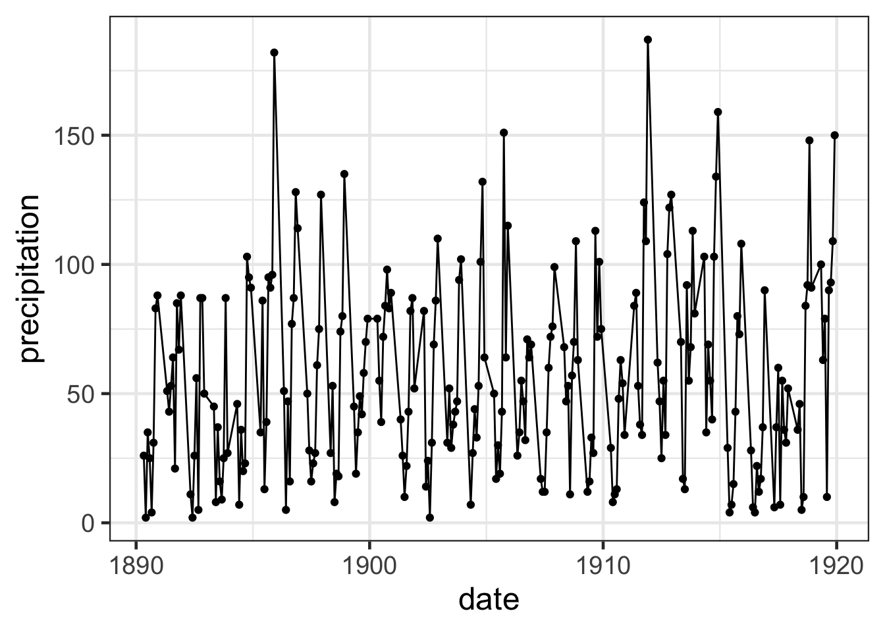
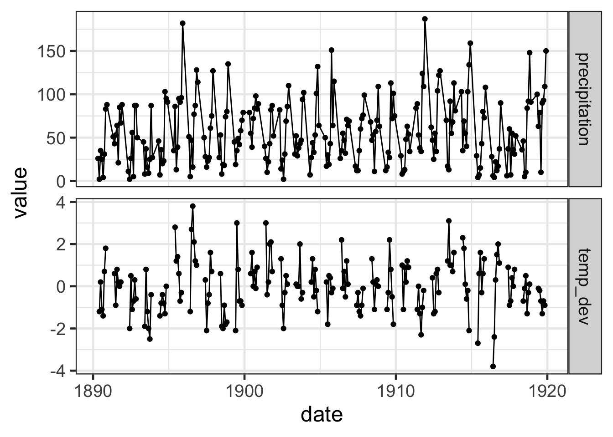
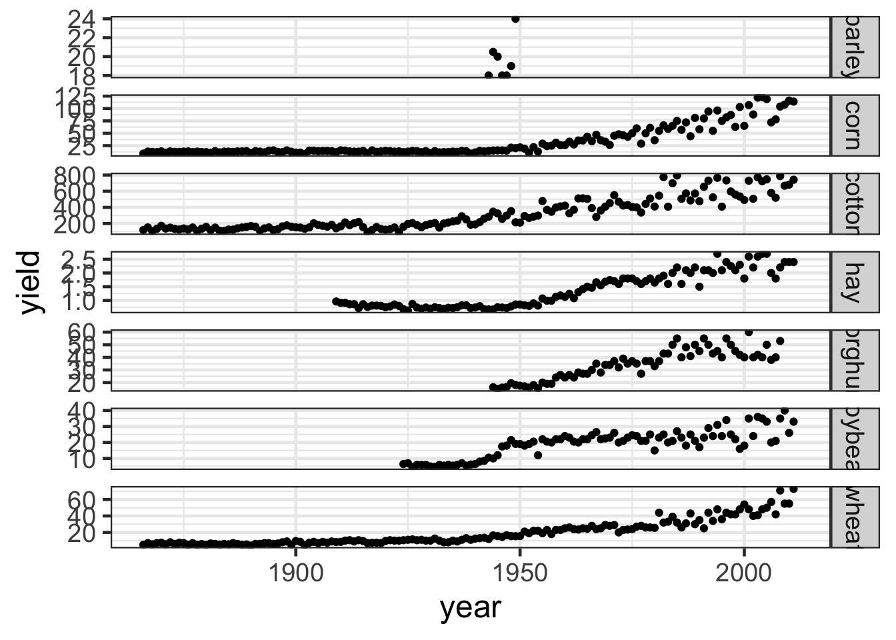
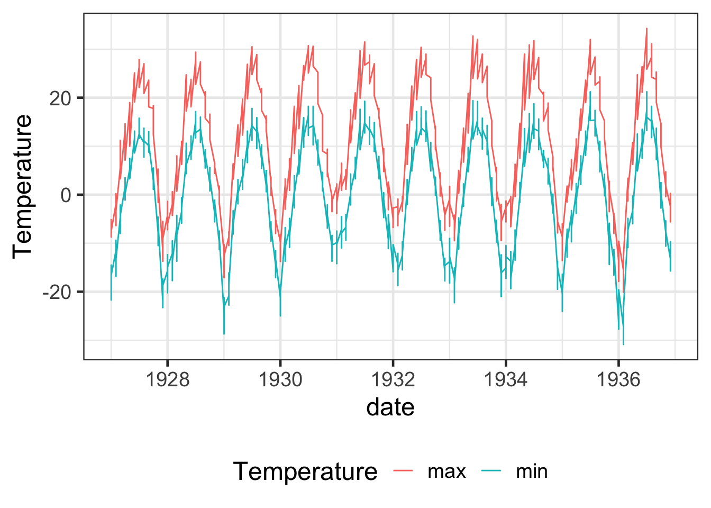

---
output:
  html_document:
    toc: true
    toc_float: true
---

```{r setup, include = FALSE}
library(tidyverse)
library(agridat)
library(scales)
```


# Exercise 1

For the data `hessling.argentina`, find the mean of every variable *except* `year`

```{r exercise-01s}
# insert your code here!
```


# Exercise 2

For the data `hessling.argentina`, plot the precipitation from May to December for the available years as below.

```{r exercise-02, echo = FALSE}

```


```{r exercise-02s}
# insert your code here!
```

# Exercise 3


For the data `hessling.argentina`, plot the precipitation and the temperature deviation on different facets for available dates as below.

```{r exercise-03, echo = FALSE}

```


```{r exercise-03s}
# insert your code here!
```


# Exercise 4

For the data sets `nass.barley`, `nass.corn`, `nass.cotton`, `nass.hay`, `nass.rice`,  `nass.sorghum`, `nass.soybean`, `nass.wheat`, plot the yield over time facetted by crop as below plot.


```{r exercise-04, echo = FALSE}

```

```{r exercise-04s}
# insert your code here!
```

# Exercise 5

Revisit the data `minnesota.barley.weather` and plot the minimum and maximum temperature over time with a legend to indicate the minimum and maximum lines.

```{r exercise-05, echo = FALSE}

```

```{r exercise-05s}
# insert your code here!
```
