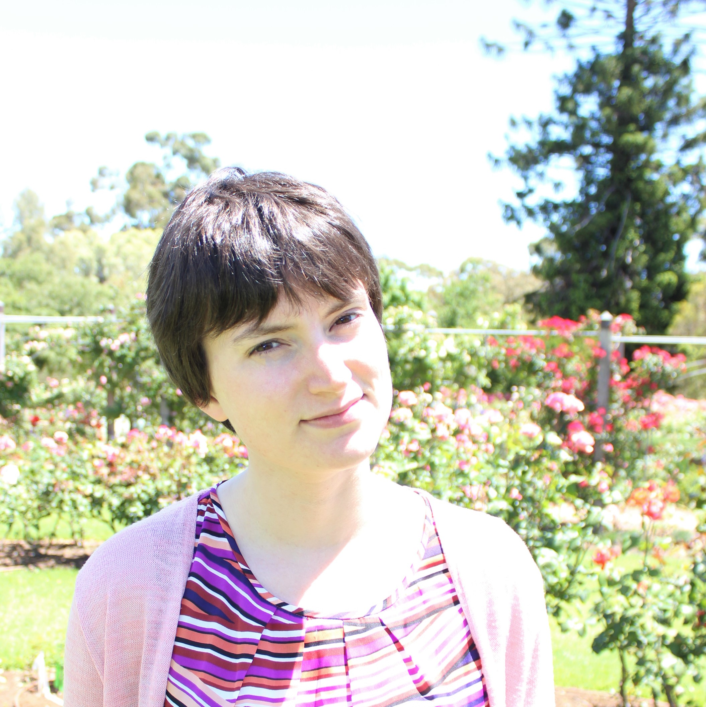

```{r external, child="scripts/setup.Rmd", include=FALSE}
```
```{r titleslide, child="scripts/titleslide.Rmd"}
```

---

::: {.grid grid: 1fr / 1.2fr 2fr;}


::: item bg-pro

<br>

<div class="circle-image">
<center>

</center>
</div>

**Emi Tanaka** <br>
*Lecturer in Statistics*<br>
The University of Sydney

<br>

<i class="fas fa-globe"></i> https://emitanaka.org/

<i class="fas fa-envelope"></i> dr.emi.tanaka@gmail.com

<i class="fab fa-twitter"></i> @statsgen

:::

::: item 

# About your instructor

* I'm moving to Monash University starting January 2020
* I teach R at university courses as well as use it daily for research and hobby
* If you ever wonder who answers those stackoverflow questions, I'm one of those magic fairies

<center>
<a href="https://stackexchange/users/10113966/emi"></a>
</center>
* My main statistical application is agriculture and bioinformatics; these days I do more software


:::

:::

---

::: {.grid grid: 1fr / 2fr 2fr;}


::: item bg-pro

<br>

<div class="circle-image">
<center>

</center>
</div>

**Annie Conway**  
*Biometrician*  
  
Biometry Hub  
School of Agriculture, Food and Wine  
The University of Adelaide

  

<i class="fas fa-envelope"></i> annie.conway@adelaide.edu.au


:::

::: item 

# Meet Annie!

* I’ve been working as a biometrician for one year in the Biometry Hub

* I’m interested in multivariate and high dimensional statistics, experimental design and linear mixed models.

* I’ve had previous experience teaching "Intro to R" to agronomy researchers

:::

:::

---

class: center middle


.font_large[Introduce yourself to someone you don't know!]

Find out their name.  
What profession.  
What they want to learn.  
What's their hobbies.  
Are they going to the conference?


`r countdown::countdown(3, font_size = "1em")`


---

# Schedule: Tidyverse

<br>

Time | Activity 
:----|:---
8.30-8.50 | Registration
8.50-9.00 | Welcome 
9.00-11.00 | **Lesson 1**<Br> Introduction +<br>Data visualisation with `ggplot2` +<br>Interactive graphs with `plotly`
11.00 - 11.30 | *Coffee Break*
11.30 - 13.00 | **Lesson 2**<Br>Data wrangling with dplyr & tidyr 

---

# Schedule: R Markdown

<br>


Time | Activity 
:----|:---
13.00 - 13.45 | *Lunch*
13.45 - 15.00 | **Lesson 3**<br>R Markdown Basics with `rmarkdown` & `knitr`
15.00 - 15.30 | *Tea Break*
15.30 - 16.30 | **Lesson 4** <br>Reproducible Reports 
16.30 - 15.00 | **Lesson 5**<br>Pretty Presentations with `xaringan`

---

# Get Started

::: paddings

Find slides at<br><Br>


.center[
.blue[<i class="fas fa-link"></i> https://biometrics2019.netlify.com/]
]

<br>


::: info-box

.red[**If you had any issues installing any packages or software**] go to:<br><br>

.center[
.blue[<i class="fas fa-link"></i>  http://bit.ly/biometrics-workshop-2019]
]

<br>

and save a permanent copy to your RStudio Cloud account for the R exercises.

:::


:::

---

# Help me!


::: paddings center font_large


Please send SOS signal by attaching a sticky note on your laptop
  
<br><br>
  
Annie or I will come to help you


:::


---

```{r endslide, child="scripts/endslide.Rmd"}
```
