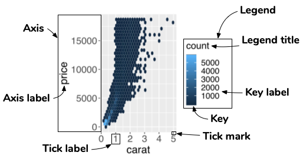
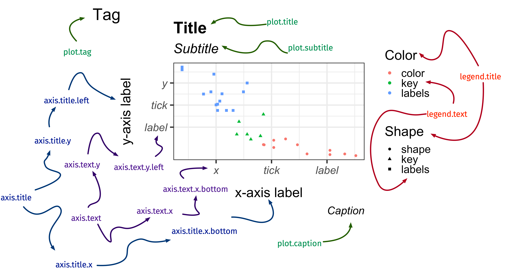

```{r external, child="scripts/setup.Rmd", include=FALSE}
```
```{r titleslide, child="scripts/titleslide.Rmd"}
```
```{r wine-graph, child="scripts/wine-graph.Rmd"}
```
```{r, include = FALSE}
knitr::opts_chunk$set(
  fig.path = "figure/session1/"
)
```


---

class: font_smaller

# `r emo::ji("target")` Aim: draw beautiful plots like this using (layered) grammar of graphics


::: grid 

::: item 

```{r state-wine, echo = FALSE, fig.width = 7.8}
```


:::

::: item 

```{r variety-wine, echo = FALSE, fig.width = 7.8}
```


:::


:::


---

#  Basic structure of ggplot: 3 `r emo::ji("key")` components

<center>
<br>


</center>


::: { .info-box .pos width: 60%; margin-left: 20%; font-size: 24pt; }

1. **data**, 
2. a set of **aesthetic** mappings between variables in the data and visual properties, and
3. at least one **layer** which describes how to render each observation. 

:::


::: footnote
Reference: Wickham (2015) ggplot2 Elegant Graphics for Data Analysis
:::

---

class: font_smaller

# `r emo::ji("card_file_box")` Data:  .blue[Classic iris dataset]

`iris` is a built-in dataset in R - type `iris` to your console and press <kbd>Enter</kbd>. 

```{r}
skimr::skim(iris)
```


<div class = "font_small" style = "position:absolute;top:300px;right:8%;width:530px;">Image source: <a href="http://suruchifialoke.com/2016-10-13-machine-learning-tutorial-iris-classification/">suruchifialoke.com</a>
</div>

---


# Aesthestic mappings: `aethestic = column`


<center>

</center>

::: paddings

<br>

* `Sepal.Length` is mapped to the `x` coordinate
* `Sepal.Width` is mapped to the `y` coordinate
* `Species` is mapped to the `color`

:::

---

# Layer 

<br>

::: { .info-box .pos width: 70%; margin-left: 15%; font-size: 24pt; }


Each layer has a 
* `geom` - the geometric object to use display the data,
* `stat` - statisitcal transformations to use on the data, 
* `data` and `mapping` which is usually inherited from `ggplot` object,

:::

::: paddings

Further specifications are provided by `position` adjustment, `show_legend` and so on. 

:::

---

# Hidden argument names in ggplot

<center>

</center>

--- 

::: grid font_smaller

::: item 

```{r, fig.height = 2.5, fig.width = 4}
ggplot(iris, aes(Species))
```


```{r, fig.height = 2.5, fig.width = 4}
ggplot(iris, aes(Species, Sepal.Length))
```


:::

::: item 

* No need to write explicitly write out `data = `, `mapping = `, `x = `, and `y = ` each time in `ggplot`.
* `ggplot` code in the wild often omit these argument names.
* But position needs to be correct if argument name not specified!
* If no layer is specified, then plot is `geom_blank()`.

:::

:::

---

# Example layer: geom_point()

The `<layer>` is usually created by a function preceded by `geom_` in its name.

```{r, eval = FALSE}
ggplot(iris, aes(Species, Sepal.Length)) +
  geom_point() #<<
```

<br>
is a shorthand for 
<br>


```{r, eval = FALSE}
ggplot(iris, aes(Species, Sepal.Length)) +
  layer(geom = "point", #<<
        stat = "identity", position = "identity",  #<<
        params = list(na.rm = FALSE)) #<<
```


---


# Different geometric objects

```{r}
p <- ggplot(iris, aes(Species, Sepal.Length))
```


::: grid 

::: item 

```{r, fig.height = 4, fig.width = 4}
p + geom_violin()
```

:::

::: item 

```{r boxplot, fig.height = 4, fig.width = 4}
p + geom_boxplot()
```

:::

::: item 

```{r, fig.height = 4, fig.width = 4}
p + geom_point()
```

:::


:::

---

name: geom
class: hide-slide-number

# `geom`


```{r geom, echo=FALSE}
geoms <- help.search("^geom_", package = "ggplot2")
geoms$matches %>% 
  select(Entry, Title) %>% 
  group_by(Title) %>% 
  mutate(col = paste0("C", 1:n())) %>% 
  ungroup() %>% 
  pivot_wider(names_from = col, values_from = Entry) %>% 
  mutate(geom = paste(C1, C2, C3, C4, sep = ", "),
         geom = gsub(", NA", "", geom)) %>% 
  select(geom, Title) %>% 
  DT::datatable(colnames = c("geom", "Description"),
                rownames = FALSE,
                options = list(dom = 'tp', ordering=F)) 
```

---

class: font_smaller

# Statistical transformation

```{r}
g <- ggplot(iris, aes(Species, Sepal.Length)) + geom_boxplot()
```

::: { .grid grid: 1fr / 300px 900px; } 

::: item 

```{r boxplot, echo = FALSE, fig.height = 4, fig.width = 4}
```

<p></p>

:::

::: item 

* The `y`-axis is not the raw data!
* It is plotting a statistical transformation of the `y`-values. 
* Under the hood, data is transformed (including `x` factor input to numerical values).

```{r}
layer_data(g, 1)
```
<p></p>

:::

:::

---

class: font_smaller

# Statistical transformation: stat_bin


* For `geom_histogram`, default is `stat = "bin"`.
* For `stat_bin`, default is `geom = "bar"`.
* .pink[Every `geom` has a `stat` and vice versa].

```{r}
p <- ggplot(iris, aes(Sepal.Length)) 
```


::: { .grid  grid: 1fr / 1fr 1fr 1fr; }

::: item 


```{r, fig.height = 3, fig.width = 4}
p + geom_histogram()
```


::: 

::: item 


```{r, fig.height = 3, fig.width = 4}
p + stat_bin(geom = "bar")
```


::: 

::: item 


```{r, fig.height = 3, fig.width = 4}
p + stat_bin(geom = "line")
```
<p></p>

:::


:::


---

class: font_smaller

# Using statistical transformations

To map an aesthestic to computed statistical variable (say called .pink[`var`]), you can refer to it by either .pink[`stat(var)`] or .pink[`..var..`].

--- 

::: grid 

::: item 

`stat = "bin"`

```{r, echo = FALSE}
g <- p + stat_bin(geom = "line")
layer_data(g, 1) %>% select(x, count, density) 
```
<p></p>

:::


::: item 

```{r, fig.width = 5, fig.height = 4}
p + geom_histogram(aes(y = stat(density) ))
```
```{r, eval = F}
p + geom_histogram(aes(y = ..density.. ))
```

:::

:::


---

name: stat
class: hide-slide-number

# `stat`


```{r stat, echo=FALSE}
stats <- help.search("stat_", package = "ggplot2")
stats$matches %>% 
  select(Entry, Title) %>% 
  group_by(Title) %>% 
  mutate(col = paste0("C", 1:n())) %>% 
  ungroup() %>% 
  pivot_wider(names_from = col, values_from = Entry) %>% 
  mutate(stats = paste(C1, C2, C3, sep = ", "),
         stats = gsub(", NA", "", stats)) %>% 
  select(stats, Title) %>% 
  DT::datatable(colnames = c("stat", "Description"),
                rownames = FALSE,
                options = list(dom = 'tp', ordering=F))

```


---

# Add multiple layers

<center>

</center>


::: grid font_smaller

::: item 

Each layer inherits mapping and data from `ggplot` by default.  


```{r plot1, eval=FALSE}
ggplot(data = iris, aes(x = Species, y = Sepal.Length)) +
  geom_violin() + 
  geom_boxplot() + 
  geom_point()
```
<p></p>

::: 

::: item 

```{r plot1, echo = FALSE, fig.height = 4, fig.width = 4}
```

::: 

:::

---

# Order of the layers matters!

Boxplot and violin plot order are switched around. 

::: { .grid .font_smaller grid: 250px 250px / 1fr 1fr; }

::: item 

```{r plot1a, eval=FALSE}
ggplot(data = iris, aes(x = Species, y = Sepal.Length)) +
  geom_violin() + #<<
  geom_boxplot() + #<<
  geom_point()
```

::: 

::: item 

```{r plot1a, echo = FALSE, fig.height = 3, fig.width = 4}
```

::: 

::: item 

```{r plot1b, eval=FALSE}
ggplot(data = iris, aes(x = Species, y = Sepal.Length)) +
  geom_boxplot() + #<<
  geom_violin() + #<<
  geom_point()
```


::: 

::: item 

```{r plot1b, echo = FALSE, fig.height = 3, fig.width = 4}
```

::: 

:::


---

class: font_smaller

# Layer-specific data and aesthestic mappings

<center>

</center>

::: grid

::: item 

For each layer, aesthestic and/or data can be overwritten.


```{r plot2, eval=FALSE}
ggplot(iris, aes(Species, Sepal.Length)) +
  geom_violin(aes(fill = Species)) +
  geom_boxplot(data = filter(iris, Species=="setosa")) +
  geom_point(data = filter(iris, Species=="setosa"),
             aes(y = Sepal.Width))
```


:::

::: item


```{r plot2, echo = FALSE, fig.width = 5, fig.height = 4.5}
```


:::

:::

---

class: font_smaller 

# Facetting

```{r}
g <- ggplot(iris, aes(Sepal.Length, Sepal.Width, color = Species)) + geom_point()
```


::: { .grid border-top: dashed 3px black; }

::: item 

```{r, fig.width = 5, fig.height = 2.8}
g
```


```{r plot3, fig.width = 7, fig.height = 3}
g + facet_wrap(~Species)
```
<p></p>


:::

::: item


```{r, fig.width = 7, fig.height = 5}
g + facet_grid(cut(Petal.Length, 3) ~ Species)
```

:::

:::


---

background-color: #e5e5e5

::: { .grid grid: 1fr / 3fr 1fr;}

::: item 

<a href="https://github.com/rstudio/cheatsheets/blob/master/data-visualization-2.1.pdf"></a>

:::

::: item 

HELP!

* RStudio > Help > Cheatsheets
* [R4DS Community Slack](https://www.rfordatasci.com/)
* [Twitter with hastag #rstats](https://twitter.com/search?q=%23rstats)
* [RStudio Community](https://community.rstudio.com/)
* [Stackoverflow](https://stackoverflow.com/questions/tagged/ggplot)


:::

:::

---

class: font_small

# Recreate-the-plot Game

```{r}
colnames(iris)
```
<p></p>

::: { .grid grid: 1fr / 1fr 2fr;}

::: item 

```{r, echo = FALSE, fig.width = 6, fig.height = 5}
ggplot(iris, aes(Species, Sepal.Width)) + 
  geom_violin(aes(fill = Species)) + 
  geom_boxplot(width = 0.1) 
```

::: 

::: item 

What are the `mapping`s and `geom`s?

* `x = ?`
* `y = ?`
* `color = ?`
* `fill = ?`
* `geom_???`
* other ?


::: 

:::

---

class: middle center

Open and go through:

`challenge-01-recreate-ggplot.Rmd`

<br>

For answers go to (but don't look until trying!):

`challenge-01-recreate-ggplot-solution.Rmd`


`r countdown::countdown(20, font_size = "1em")`


---

class: transition middle animated slideInLeft

# Scales

---

class: font_smaller2

# Diamonds data

```{r}
skimr::skim(diamonds)
```
<p></p>

::: {.pos font-size:80pt; top: 14%; right: 14%;}

`r emo::ji("gem")`

:::


---

class: font_smaller

# Scales 

* Scales control the mapping from .blue[data] to .blue[aesthetics]. 

<center>

</center>

```{r}
g <- ggplot(diamonds, aes(carat, price) ) + geom_hex()
```


::: grid 

::: item 
```{r diamond1, fig.height = 3.5, fig.width = 4}
g + scale_y_continuous() +
  scale_x_continuous()
```
```{r diamond1, fig.height = 3.5, fig.width = 4, fig.show='hide', dev = 'pdf', echo = FALSE}
```

::: 

::: item 

```{r diamond2, fig.height = 3.5, fig.width = 4}
g + scale_x_reverse() +
  scale_y_continuous(trans="log10")
```

::: 

::: item 

```{r diamond3, fig.height = 3.5, fig.width = 4}
g + scale_y_log10() + 
  scale_x_sqrt()
```


::: 

:::

---

name: scale
class: hide-slide-number

# `scale`


```{r scale, echo=FALSE}
scales <- help.search("^scale_", package = "ggplot2")
scales$matches %>% 
  select(Entry, Title) %>% 
  group_by(Title) %>% 
  mutate(col = paste0("C", 1:n())) %>% 
  ungroup() %>% 
  pivot_wider(names_from = col, values_from = Entry) %>% 
  mutate(scales = paste(C1, C2, C3, C4, C5, C6, C7, C8, C9, C10, C11, C12, C13, sep = ", "),
         scales = gsub(", NA", "", scales)) %>% 
  select(scales, Title) %>% 
  DT::datatable(colnames = c("scales", "Description"),
                rownames = FALSE,
                options = list(dom = 'tp', ordering=F, pageLength = 4,
                               autoWidth = TRUE, columnDefs = list(list(width = '400px', targets = c(0)))),
                )

```


---

# Guide: an axis or a legend 

* The scale creates a .blue[guide]: an .blue[axis] or .blue[legend].
* So to modify these you generally use .blue[`scale_*`] or other handy functions (`guides`, `labs`, `xlab`, `ylab` and so on).

<center>

</center>


---

# Modify axis 


```{r, fig.height = 4, fig.width = 6}
g + 
  scale_y_continuous(name = "Price", 
                     breaks = c(0, 10000),
                     labels = c("0", "More\n than\n 10K")) + 
  geom_hline(yintercept = 10000, color = "red", size = 2)
```

---

# Nicer formatting functions in `scales` `r emo::ji("package")`

```{r, fig.height = 4, fig.width = 6}
g + 
  scale_y_continuous(
    label = scales::dollar_format()  #<<
  )
```

---

# Modifying legend


```{r, fig.height = 4, fig.width = 6}
g + 
  scale_fill_continuous(
    breaks = c(0, 10, 100, 1000, 4000),
    trans = "log10"
  )
```

---

# Removing legend 

```{r, fig.height = 4, fig.width = 6}
g + 
  scale_fill_continuous(
    guide = "none"
  )
```

---

# Alternative control of guides

```{r, fig.height = 4, fig.height = 4}
g + 
  ylab("Price") + # Changes the y axis label
  labs(x = "Carat", # Changes the x axis label
       fill = "Count") # Changes the legend name 
```

```{r, eval = FALSE}
g + guides(fill = "none") # remove the legend
```

---

class: middle center

Open and go through:

`challenge-02-ggplot-scales.Rmd`

<br>

For answers go to (but again don't look until trying!):

`challenge-02-ggplot-scales-solution.Rmd`


`r countdown::countdown(15, font_size = "1em")`


---

class: transition middle animated slideInLeft

# Themes

---

# How to change the look?

::: grid 

::: item 

```{r state-wine, echo = FALSE, fig.width = 7.8}
```


:::

::: item 

```{r variety-wine, echo = FALSE, fig.width = 7.8}
```


:::


:::


---

class: center

# `theme`: modify the *look* of texts




.font_large[`element_text()`]

---

class: font_small

# `element_text()`


::: { .grid grid: 1fr / 1fr 1fr; }

::: item 

```{r ele-text, eval = F}
ggplot(diamonds, aes(carat, price)) + geom_hex() +
 labs(title = "Diamond") +
 theme(axis.title.x = element_text(size = 30,
                                 color = "red",
                                 face = "bold",
                                 angle = 10,
                                 family = "Fira Code"),
       legend.title = element_text(size = 25,
                                   color = "#ef42eb", 
                                   margin = margin(b = 5)),
       plot.title = element_text(size = 35,
                                 face = "bold",
                                 family = "Nunito",
                                 color = "blue"
                                ))
```
<p></p>

::: 

::: item 

```{r ele-text, echo = F, fig.width = 3.8, fig.height = 4.5}
```

<p></p>

:::

:::

---

class: center

# `theme`: modify the *look* of the lines


.font_large[`element_line()`]

---

class: font_small

# `element_line()`


::: { .grid grid: 1fr / 1fr 1fr; }

::: item 

```{r ele-line, eval = F}
ggplot(iris, aes(Sepal.Length, Sepal.Width)) + geom_point() +
 theme(axis.line.y = element_line(color = "black",
                                  size = 1.2,
                                  arrow = grid::arrow()),
       axis.line.x = element_line(linetype = "dashed", 
                                  color = "brown",
                                  size = 1.2),
       axis.ticks = element_line(color = "red", size = 1.1),
       axis.ticks.length = unit(3, "mm"),
       panel.grid.major = element_line(color = "blue", 
                                       size = 1.2),
       panel.grid.minor = element_line(color = "#0080ff",
                                       size = 1.2,
                                       linetype = "dotted"))
```
<p></p>

::: 

::: item 

```{r ele-line, echo = F, fig.width = 3.2, fig.height = 4.5}
```

<p></p>

:::

:::

---

class: center

# `theme`: modify the *look* of the <br>rectangular regions


.font_large[`element_rect()`]


---

class: font_small

# `element_line()`


::: { .grid grid: 1fr / 1fr 1fr; }

::: item 

```{r ele-rect, eval = F}
ggplot(iris, aes(Sepal.Length, Sepal.Width)) + 
 geom_point(aes(color = Species)) +
 theme(
  legend.background = element_rect(fill = "#fff6c2", 
                                  color = "black",
                               linetype = "dashed"),
  legend.key = element_rect(fill = "grey", color = "brown"),
  panel.background = element_rect(fill = "#005F59",
                          color = "red", size = 3),
  panel.border = element_rect(color = "black", 
                              fill = "transparent",
                    linetype = "dashed", size = 3),
  plot.background = element_rect(fill = "#a1dce9",
                                color = "black",
                                 size = 1.3),
       legend.position = "bottom")
```
<p></p>

::: 

::: item 

```{r ele-rect, echo = F, fig.width = 3.2, fig.height = 4.5}
```

<p></p>

:::

:::


---

class: middle center

Open and go through:

`challenge-03-ggplot-themes.Rmd`

<br>

For answers go to:

`challenge-03-ggplot-themes-solution.Rmd`


---

```{r endslide, child="scripts/endslide.Rmd"}
```

