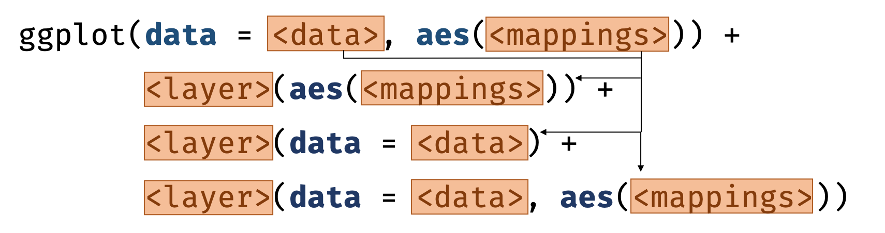
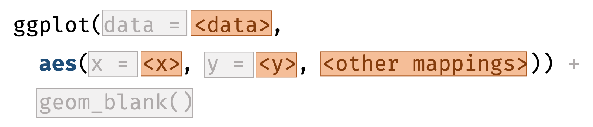

```{r external, child="scripts/setup.Rmd", include=FALSE}
```
```{r titleslide, child="scripts/titleslide.Rmd"}
```

---

# Basic structure of ggplot

<center>

.font_large[3 keys components]

<br>


</center>


::: info

1. **data**, 
2. a set of **aesthetic** mappings between variables in the data and visual properties, and
3. at least one **layer** which describes how to render each observation. 

:::

::: bottom_abs width100 font_small bg-black white pad10
Reference: Wickham (2015) ggplot2 Elegant Graphics for Data Analysis
:::

---

# Different geometric objects

```{r}
p <- ggplot(data = iris, aes(Species, Sepal.Length))
```


::: grid 

::: item 

```{r, fig.height = 4, fig.width = 4}
p + geom_violin()
```

:::

::: item 

```{r, fig.height = 4, fig.width = 4}
p + geom_boxplot()
```

:::

::: item 

```{r, fig.height = 4, fig.width = 4}
p + geom_point()
```

:::


:::

---

# Add multiple layers

<center>

</center>


::: grid font_smaller

::: item 

Each layer inherits mapping and data from `ggplot`.  


```{r plot1, eval=FALSE}
ggplot(data = iris, aes(x = Species, y = Sepal.Length)) +
  geom_violin() +
  geom_boxplot() +
  geom_point()
  

```
<p></p>

::: 

::: item 

```{r plot1, echo = FALSE, fig.height = 4, fig.width = 4}
```

::: 

:::

---

# Layer

<center>

</center>

::: grid

::: item 

::: { .info width: 300px; margin: 0px 50px; }

Each layer has a 
* geom (or stat), 
* data, 
* mapping.

:::

:::

::: item

For each layer, aesthestic and/or data can be overwritten.

:::

:::

---

# Invisible elements in ggplot

<center>

</center>

--- 

::: grid font_smaller

::: item 

```{r, fig.height = 3, fig.width = 3}
ggplot(iris, aes(Species, Sepal.Length))
```

:::

::: item 

* No need to write explicitely write out `data = `, `x = `, and `y = ` each time.
* The default layer is `geom_blank()`.

:::

:::


---

```{r endslide, child="scripts/endslide.Rmd"}
```

