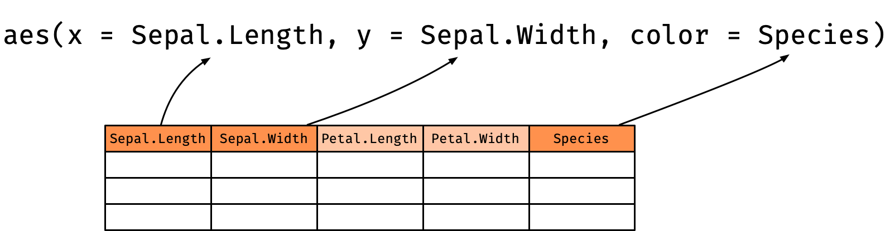

```{r external, child="scripts/setup.Rmd", include=FALSE}
```
```{r titleslide, child="scripts/titleslide.Rmd"}
```
```{r wine-graph, child="scripts/wine-graph.Rmd"}
```

---

class: font_smaller

# Aim: draw beautiful plots like this using (layered) grammar of graphics


::: grid 

::: item 

```{r state-wine, echo = FALSE, fig.width = 7.8}
```


:::

::: item 

```{r variety-wine, echo = FALSE, fig.width = 7.8}
```


:::


:::


---

# Basic structure of ggplot: 3 keys components

<center>
<br>


</center>


::: info

1. **data**, 
2. a set of **aesthetic** mappings between variables in the data and visual properties, and
3. at least one **layer** which describes how to render each observation. 

:::

::: bottom_abs width100 font_small bg-black white pad10
Reference: Wickham (2015) ggplot2 Elegant Graphics for Data Analysis
:::

---

class: font_smaller

# Data:  .blue[Classic iris dataset (for ggplot demo)]

`iris` is a built-in dataset in R - type `iris` to your console and press <kbd>Enter</kbd>. 

```{r}
skimr::skim(iris)
```


<div class = "font_small" style = "position:absolute;top:340px;right:8%;width:650px;">Image source: <a href="http://suruchifialoke.com/2016-10-13-machine-learning-tutorial-iris-classification/">suruchifialoke.com</a>
</div>

---


# Aesthestic mappings: `aethestic = column`


<center>

</center>

* `Sepal.Length` is mapped to the `x` coordinate
* `Sepal.Width` is mapped to the `y` coordinate
* `Species` is mapped to the `color`


---

# Layer 

<br>

::: { .info }


Each layer has a 
* `geom` - the geometric object to use display the data,
* `stat` - statisitcal transformations to use on the data, 
* `data` and `mapping` which is usually inherited from `ggplot` object,

:::

Further specifications are provided by `position` adjustment, `show_legend` and so on. 

---

# Hidden argument names in ggplot

<center>

</center>

--- 

::: grid font_smaller

::: item 

```{r, fig.height = 2.5, fig.width = 4}
ggplot(iris, aes(Species))
```


```{r, fig.height = 2.5, fig.width = 4}
ggplot(iris, aes(Species, Sepal.Length))
```


:::

::: item 

* No need to write explicitly write out `data = `, `mapping = `, `x = `, and `y = ` each time in `ggplot`.
* `ggplot` code in the wild often omit these argument names.
* But position needs to be correct if argument name not specified!
* If no layer is specified, then plot is `geom_blank()`.

:::

:::

---

# Example layer: geom_point()

The `<layer>` is usually created by a function preceded by `geom_` in its name.

```{r, eval = FALSE}
ggplot(iris, aes(Species, Sepal.Length)) +
  geom_point() #<<
```

<br>
is a shorthand for 
<br>


```{r, eval = FALSE}
ggplot(iris, aes(Species, Sepal.Length)) +
  layer(geom = "point", #<<
        stat = "identity", position = "identity",  #<<
        params = list(na.rm = FALSE)) #<<
```


---


# Different geometric objects

```{r}
p <- ggplot(iris, aes(Species, Sepal.Length))
```


::: grid 

::: item 

```{r, fig.height = 4, fig.width = 4}
p + geom_violin()
```

:::

::: item 

```{r boxplot, fig.height = 4, fig.width = 4}
p + geom_boxplot()
```

:::

::: item 

```{r, fig.height = 4, fig.width = 4}
p + geom_point()
```

:::


:::

---

name: geom
class: hide-slide-number

# (Most) geom objects


```{r geom, echo=FALSE}
geoms <- help.search("^geom_", package = "ggplot2")
geoms$matches[, 1:2] %>% 
  distinct() %>% 
  filter(Topic!="ggsf") %>% 
  DT::datatable(colnames = c("geom", "Description"),
                rownames = FALSE,
                options = list(dom = 'tp'))
```

---

class: font_smaller

# Statistical transformation

```{r}
g <- ggplot(iris, aes(Species, Sepal.Length)) + geom_boxplot()
```

::: { .grid grid: 1fr / 300px 900px; } 

::: item 

```{r boxplot, echo = FALSE, fig.height = 4, fig.width = 4}
```

<p></p>

:::

::: item 

* The `y`-axis is not the raw data!
* It is plotting a statistical transformation of the `y`-values. 
* Under the hood, data is transformed (including `x` factor input to numerical values).

```{r}
layer_data(g, 1)
```
<p></p>

:::

:::

---

class: font_smaller

# Statistical transformation: stat_bin


* For `geom_histogram`, default is `stat = "bin"`.
* For `stat_bin`, default is `geom = "bar"`.
* .pink[Every `geom` has a `stat` and vice versa].

```{r}
p <- ggplot(iris, aes(Sepal.Length)) 
```


::: { .grid  grid: 1fr / 1fr 1fr 1fr; }

::: item 


```{r, fig.height = 3, fig.width = 4}
p + geom_histogram()
```


::: 

::: item 


```{r, fig.height = 3, fig.width = 4}
p + stat_bin(geom = "bar")
```


::: 

::: item 


```{r, fig.height = 3, fig.width = 4}
p + stat_bin(geom = "line")
```
<p></p>

:::


:::


---

class: font_smaller

# Using statistical transformations

To map an aesthestic to computed statistical variable (say called .pink[`stat`]), you can refer to it by surrounded its name with "`..`" (say .pink[`..stat..`]).

--- 

::: grid 

::: item 

`stat = "bin"`

```{r, echo = FALSE}
g <- p + stat_bin(geom = "line")
layer_data(g, 1) %>% select(x, count, density) 
```
<p></p>

:::


::: item 

```{r, fig.width = 5, fig.height = 5}
p + geom_histogram(aes(y = ..density.. ))
```


:::

:::


---

name: stat
class: hide-slide-number

# (Most) stat objects


```{r stat, echo=FALSE}
stats <- help.search("stat_", package = "ggplot2")
stats$matches[, c("Entry", "Title")]  %>% 
  distinct(Title, .keep_all = TRUE) %>%
  filter(Entry!="update_stat_defaults") %>% 
  DT::datatable(colnames = c("stat", "Description"),
                rownames = FALSE,
                options = list(dom = 'tp'))

```


---

# Add multiple layers

<center>

</center>


::: grid font_smaller

::: item 

Each layer inherits mapping and data from `ggplot` by default.  


```{r plot1, eval=FALSE}
ggplot(data = iris, aes(x = Species, y = Sepal.Length)) +
  geom_violin() + 
  geom_boxplot() + 
  geom_point()
```
<p></p>

::: 

::: item 

```{r plot1, echo = FALSE, fig.height = 4, fig.width = 4}
```

::: 

:::

---

# Order of the layers matters!

Boxplot and violin plot order are switched around. 

::: { .grid .font_smaller grid: 250px 250px / 1fr 1fr; }

::: item 

```{r plot1a, eval=FALSE}
ggplot(data = iris, aes(x = Species, y = Sepal.Length)) +
  geom_violin() + #<<
  geom_boxplot() + #<<
  geom_point()
```

::: 

::: item 

```{r plot1a, echo = FALSE, fig.height = 3, fig.width = 4}
```

::: 

::: item 

```{r plot1b, eval=FALSE}
ggplot(data = iris, aes(x = Species, y = Sepal.Length)) +
  geom_boxplot() + #<<
  geom_violin() + #<<
  geom_point()
```


::: 

::: item 

```{r plot1b, echo = FALSE, fig.height = 3, fig.width = 4}
```

::: 

:::


---

class: font_smaller

# Layer-specific data and aesthestic mappings

<center>

</center>

::: grid

::: item 

For each layer, aesthestic and/or data can be overwritten.


```{r plot2, eval=FALSE}
ggplot(iris, aes(Species, Sepal.Length)) +
  geom_violin(aes(fill = Species)) +
  geom_boxplot(data = filter(iris, Species=="setosa")) +
  geom_point(data = filter(iris, Species=="setosa"),
             aes(y = Sepal.Width))
```


:::

::: item


```{r plot2, echo = FALSE, fig.width = 5, fig.height = 4.5}
```


:::

:::

---

background-color: #e5e5e5

::: { .grid grid: 1fr / 3fr 1fr;}

::: item 

<a href="https://github.com/rstudio/cheatsheets/blob/master/data-visualization-2.1.pdf"></a>

:::

::: item 

HELP!

* RStudio > Help > Cheatsheets
* Google 
* stackoverflow 
* RStudio community
* R4DS Slack
* twitter with #rstats


:::

:::

---

class: font_small

# Recreate-the-plot Game

```{r}
colnames(iris)
```
<p></p>

::: { .grid grid: 1fr / 1fr 2fr;}

::: item 

```{r, echo = FALSE, fig.width = 6, fig.height = 5}
ggplot(iris, aes(Species, Sepal.Width)) + 
  geom_violin(aes(fill = Species)) + 
  geom_boxplot(width = 0.1) 
```

::: 

::: item 

What are the `mapping`s and `geom`s?

* `x = ?`
* `y = ?`
* `color = ?`
* `fill = ?`
* `geom_???`
* other ?


::: 

:::

---

class: font_smaller2

# Diamonds data

```{r}
skimr::skim(diamonds)
```


---

class: font_smaller

# Scales 

* Scales control the mapping from .blue[data] to .blue[aesthetics]. 

<center>

</center>

```{r}
g <- ggplot(iris, aes(Sepal.Width, Sepal.Length)) + geom_point()
```


::: grid 

::: item 
```{r, fig.height = 3.5, fig.width = 3.5}
g + scale_y_continuous()
```


::: 

::: item 

```{r, fig.height = 3.5, fig.width = 3.5}
g + scale_y_discrete()
```

::: 

::: item 

```{r, fig.height = 3.5, fig.width = 3.5}
g + scale_x_log10()
```


::: 

:::


---

# Guide: an axis or a legend 

* The scale creates a .blue[guide] (an .blue[axis] or .blue[legend]).


---

```{r endslide, child="scripts/endslide.Rmd"}
```

