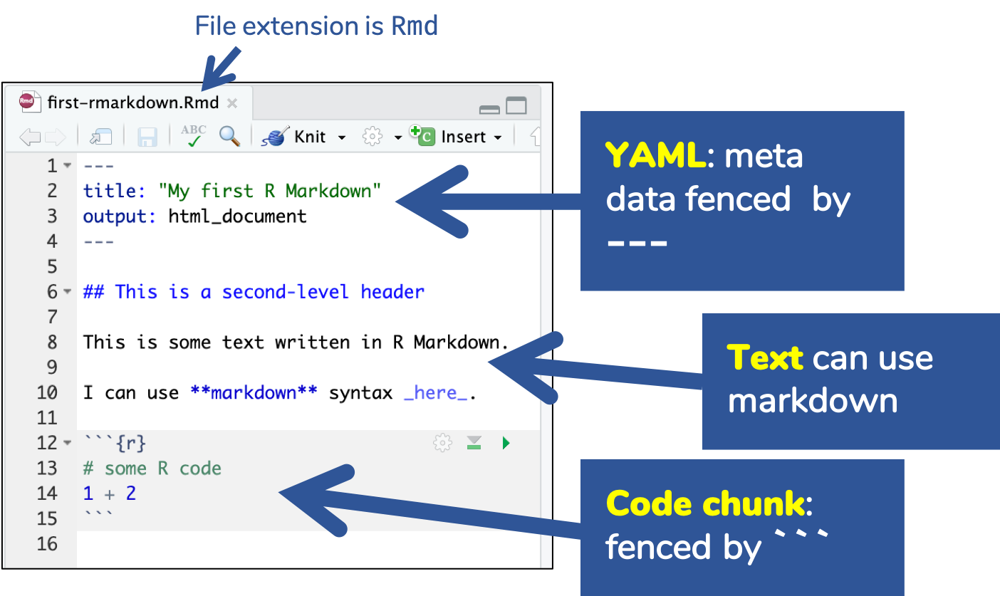
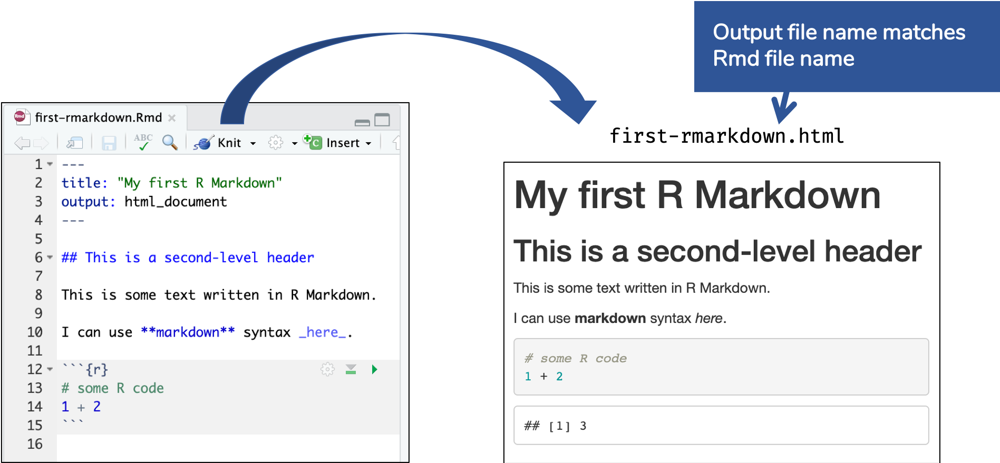
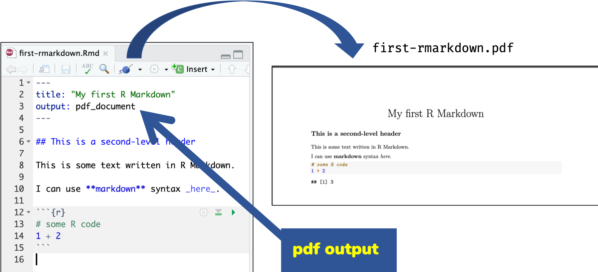

```{r external, child="scripts/setup.Rmd", include=FALSE}
```
```{r titleslide, child="scripts/titleslide.Rmd"}
```

---

# What you can do with R Markdown?

--

<br>
<center>
<iframe src="session1.html" width="80%" height="450px" style="border: solid 3px black;"></iframe>
</center>

<div class="color-box">
These <b>slides</b> are made using R Markdown.
</div>

---

# What you can do with R Markdown?

<br>
<center>
<iframe src="output/html/html_template_paper.html" width="80%" height="450px" style="border: solid 3px black;"></iframe>
</center>

<div class="color-box">
This <b>dynamic report</b> is made using R Markdown.
</div>

---

# What you can do with R Markdown?

<br>
<center>
<object data="output/articles/article_template_pnas_article.pdf" type="application/pdf" width="80%" height="450px" style="border: solid 3px black;">
<embed src="output/articles/article_template_pnas_article.pdf" type="application/pdf" />
</object>
</center>


<div class="color-box">
This <b>manuscript</b> is made using R Markdown.
</div>


---


# What you can do with R Markdown?

<br>
<center>
<iframe src="https://otexts.com/fpp2/" width="80%" height="450px" style="border: solid 3px black;"></iframe>
</center>


<div class="color-box">
This <b>online book</b> is made using R Markdown.<br>
Available at https://otexts.com/fpp2/ <br>

The <b>pdf book</b> version is also made using R Markdown. 
</div>

---

# What you can do with R Markdown?

<br>
<div class="grid" style="grid: 1fr / 1fr 1fr;">
<div class="item">
<center>
<iframe src="https://thesis.earo.me/" width="80%" height="450px" style="border: solid 3px black;"></iframe>
</center>
</div>

<div class="item">
<center>
<a href="https://github.com/earowang/thesis/blob/master/_thesis/thesis.pdf"></a>
</center>
</div>
</div>


<div class="color-box">
This <b>thesis</b> (online and pdf) is made using R Markdown.<br>
Available at https://thesis.earo.me/ <br>

</div>

---

# What you can do with R Markdown?

<br>
<div class="grid" style="grid: 1fr / 1fr 1fr;">
<div class="item">
<center>
<iframe src="https://emitanaka.org/r/posts/2018-12-12-scientific-and-technical-blogging-radix-vs-blogdown/" width="80%" height="450px" style="border: solid 3px black;"></iframe>
</center>
</div>

<div class="item">
<center>
<iframe src="https://emitanaka.rbind.io/post/scientific-and-technical-blogging-radix-vs-blogdown-remix/" width="80%" height="450px" style="border: solid 3px black;"></iframe>
</center>
</div>
</div>


<div class="color-box">
These <b>blog posts</b> are made using R Markdown.

</div>

---

# What you can do with R Markdown?

::: { .grid .grid: 1fr / 2.5fr 1fr; } 

::: item 

Possibilities are endless...

* Microsoft Word document (.doc, .docx)
* Open Document Text (.odt)
* Rich text format (.rtf)
* Power point slides (.ppt, .pptx)
* Posters (as .html or .pdf)
* Resume (as .html or .pdf)
* Interactive R Notebooks (.html)
* Markdown documents (.md)
* Dashboard (.html)

::: 

::: item 

<br>
<center>

</center>

.font_small[Check out [Xie et al. (2018) R Markdown: The Definite Guide](https://bookdown.org/yihui/rmarkdown/).]

:::

:::


---

# Before R Markdown (and Sweave)

<br>
<center>

</center>

---

# R Markdown in a nutshell `r emo::ji("peanut")`


::: paddings


R Markdown integrates .blue[**text**] + .blue[`code`] in one source document with ability to knit *to many output formats* (via Pandoc).


:::


---


class: center middle


.font_large[`r emo::ji("search")` Open and inspect the file]

.font_large[`first-rmarkdown.Rmd`]


---

# R Markdown Basics





---

# Knitting: <code>Rmd</code> <i class="far fa-file"></i>&nbsp; <i class="fas fa-arrow-right"></i>&nbsp;<code>md</code> <i class="far fa-file"></i>&nbsp;<i class="fas fa-arrow-right"></i> &nbsp;<code>html</code> <i class="far fa-file"></i>




---


# Knitting: <code>Rmd</code> <i class="far fa-file"></i>&nbsp; <i class="fas fa-arrow-right"></i>&nbsp;<code>md</code> <i class="far fa-file"></i>&nbsp;<i class="fas fa-arrow-right"></i> &nbsp;<code>pdf</code> <i class="far fa-file"></i>




---


# Themes: `html_document`  

<!-- The Modal -->
<div id="myModal" class="modal">
  <div id="caption"></div>
  <span class="close" onclick="document.getElementById('myModal').style.display='none'">&times;</span>
  <iframe class="modal-content" id="img01"></iframe><br>
</div>

You can change the look of the html document by specifying themes:
::: grid 

::: item 

* `default`  
* `cerulean`  
* `journal`   
* `flatly`  
* `darkly`  
* `readable`  
* `spacelab`  
* `united`  

:::

::: item 


* `cosmo`  
* `lumen`  
* `paper`  
* `sandstone`  
* `simplex`  
* `yeti`  
* `NULL`   

:::

::: item 


```markdown
output: 
  html_document:
    theme: cerulean
```

These [bootswatch](https://bootswatch.com/) themes attach the whole bootstrap library which makes your html file size larger.

:::

:::

---

# `prettydoc` 

<!-- The Modal -->
<div id="myModal2" class="modal">
  <div id="caption2"></div>
  <span class="close" onclick="document.getElementById('myModal2').style.display='none'">&times;</span>
  <iframe class="modal-content" id="img02"></iframe><br>
</div>

::: grid 

::: item 

`prettydoc` `r emo::ji('package')` is a community contributed `theme` that is light-weight:

* `cayman`  
* `tactile`  
* `architect`  
* `leonids`  
* `hpstr`  


:::

::: item 


```markdown
output: 
  prettydoc::html_pretty:
    theme: cayman
```

See more about it below:

https://prettydoc.statr.me/

:::

:::


---

# `rmdformats`

<!-- The Modal -->
<div id="myModal3" class="modal">
  <div id="caption3"></div>
  <span class="close" onclick="document.getElementById('myModal3').style.display='none'">&times;</span>
  <iframe class="modal-content" id="img03"></iframe><br>
</div>


::: grid 

::: item 

`rmdformats` `r emo::ji('package')` contains four built-in `html` formats: 


* `readthedown`  
* `html_clean`  
* `html_docco`  
* `material`  

:::

::: item 

You can use these formats by simply specifying the output in YAML as below:


```markdown
output: rmdformats::readthedown
```

See more about it below:

https://github.com/juba/rmdformats

:::

:::

---


```{r endslide, child="scripts/endslide.Rmd"}
```
