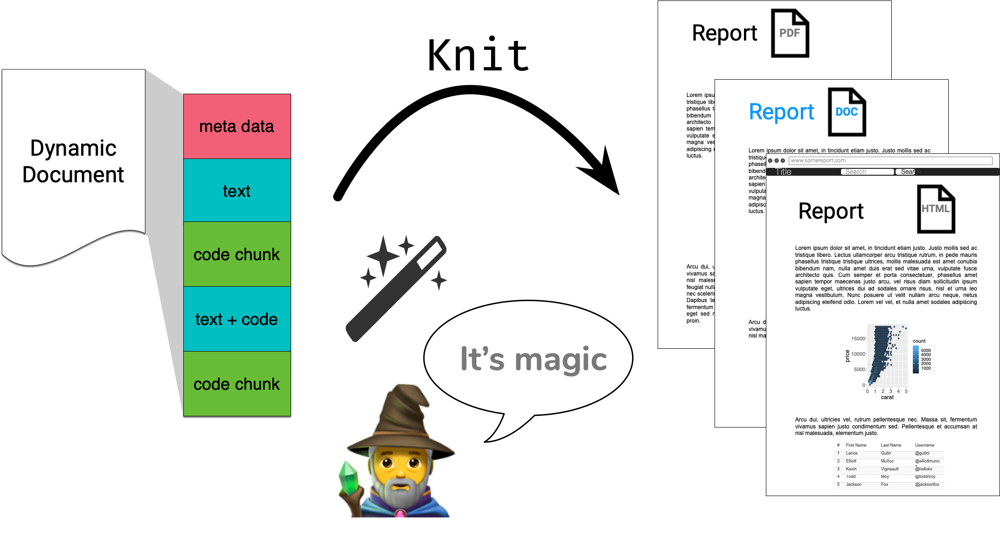
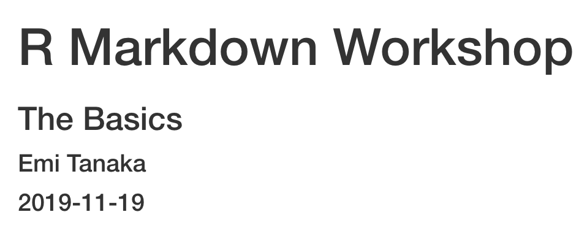
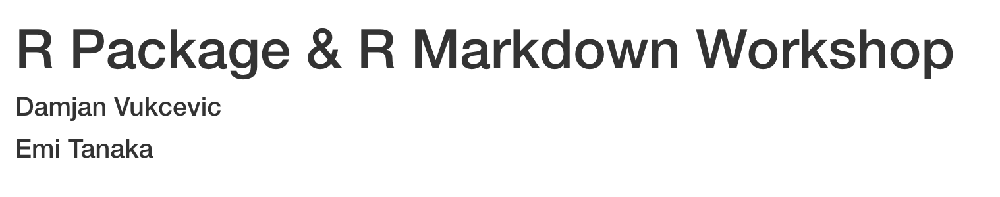
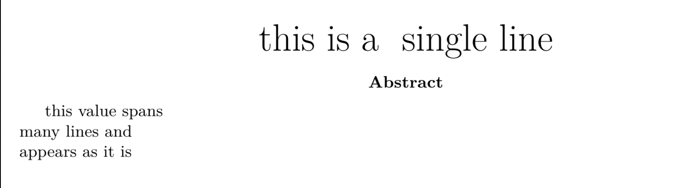
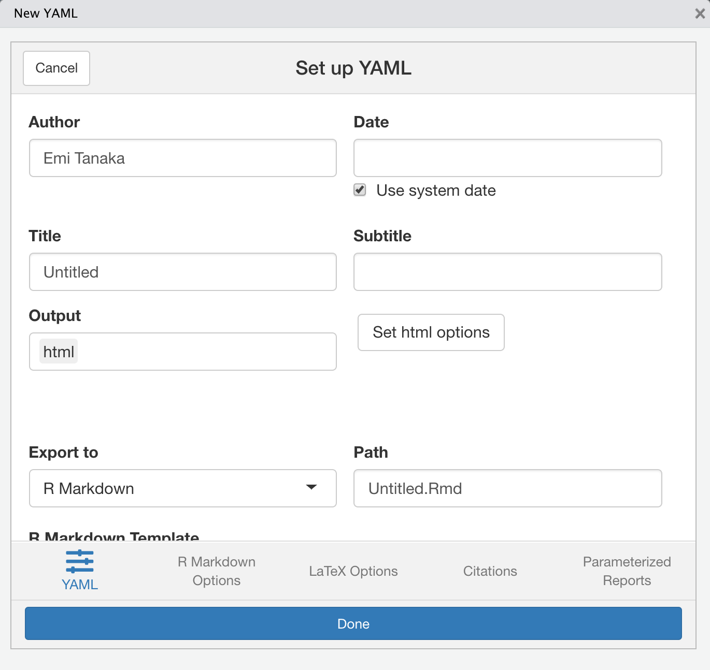
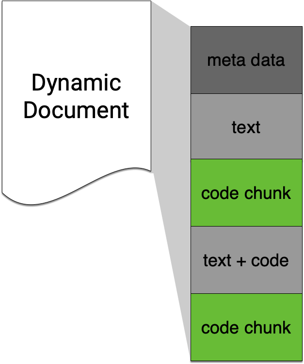
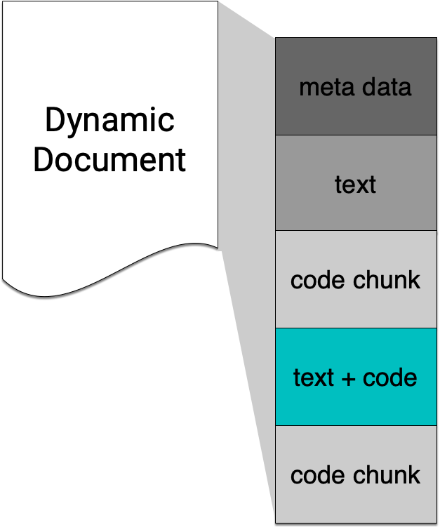
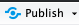
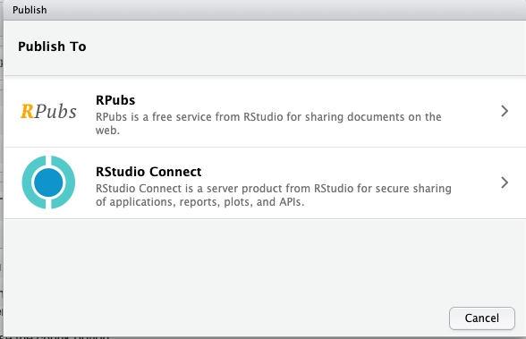

```{r external, child="scripts/setup.Rmd", include=FALSE}
```
```{r titleslide, child="scripts/titleslide.Rmd"}
```

---


class: center middle

.font_large[How does it all work?]

<br>




---

class: font_small

# R Markdown under the hood: .blue[`html_document`]

.indigo[`knitr`] `r emo::ji("package")` does the hard work of converting <code>Rmd</code> <i class="far fa-file"></i>&nbsp; <i class="fas fa-arrow-right"></i>&nbsp;<code>md</code> <i class="far fa-file"></i>
::: grid 

::: item 

````markdown
---
title: "My Report"
output: html_document
---

# Hello

`r ''````{r}
1 + 1
```


````
<p></p>

::: 

::: item 

````markdown
---
title: "My Report"
output: html_document
---

# Hello

`r ''````r
1 + 1
```

`r ''````
## [1] 2
```

````

<p></p>

:::

:::

::: {.pos top:20%;left:20%;}
`Rmd` <i class="far fa-file"></i>
:::
::: {.pos top:20%;left:70%;}
`md` <i class="far fa-file"></i>
:::


---

class: font_small

# R Markdown under the hood: .blue[`html_document`]

Then .indigo[`rmarkdown`] `r emo::ji("package")` prepares <code>md</code> <i class="far fa-file"></i> for .indigo[`pandoc`] to convert to html <i class="far fa-file"></i>.
::: grid 

::: item 

````markdown
---
title: "My Report"
output: html_document
---

# Hello

`r ''````r
1 + 1
```

`r ''````
## [1] 2
```

````

<p></p>

:::

::: item 

```html

<body>
<div class="container-fluid main-container">
<div class="fluid-row" id="header">
<h1 class="title toc-ignore">My Report</h1>
</div>
<div id="hello" class="section level1">
<h1>Hello</h1>
<pre class="r"><code>1 + 1</code></pre>
<pre><code>## [1] 2</code></pre>
</div>
</div>
</body>
```


:::

:::


::: {.white .font_small .pos bottom:60px; right:10%; width:200px;padding:5px;background-color:rgb(0,0,0, 0.3);border: solid 3px black;	}
<i class="fas  fa-exclamation-triangle"></i> This html file is missing some elements due to restriction of space.
:::

::: {.pos top:20%;left:20%;}
`md` <i class="far fa-file"></i>
:::
::: {.pos top:20%;left:70%;}
`html` <i class="far fa-file"></i>
:::

---

class: font_small

# R Markdown under the hood: .blue[`pdf_document`]

Same as before: `knitr` `r emo::ji("package")` converts <code>Rmd</code> <i class="far fa-file"></i>&nbsp; <i class="fas fa-arrow-right"></i>&nbsp;<code>md</code> <i class="far fa-file"></i>
::: grid  

::: item 

````markdown
---
title: "My Report"
output: pdf_document
---

# Hello

`r ''````{r}
1 + 1
```


````
<p></p>

::: 

::: item 

````markdown
---
title: "My Report"
output: pdf_document
---

# Hello

`r ''````r
1 + 1
```

`r ''````
## [1] 2
```

````

<p></p>

:::

:::

::: { .pos top:20%;left:20%; }
`Rmd` <i class="far fa-file"></i>
:::
::: { .pos top:20%;left:70%; }
`md` <i class="far fa-file"></i>
:::

---

class: font_small

# R Markdown under the hood: .blue[`pdf_document`]

Then `rmarkdown` `r emo::ji("package")` prepares <code>md</code> <i class="far fa-file"></i> for `pandoc` to convert to .indigo[`tex`] <i class="far fa-file"></i> <i class="fas fa-arrow-right"></i> pdf <i class="fas fa-file-pdf"></i>.
::: grid  


::: item 

````markdown
---
title: "My Report"
output: html_document
---

# Hello

`r ''````r
1 + 1
```

`r ''````
## [1] 2
```

````

<p></p>

:::

::: item 

```latex
\begin{document}
\maketitle
\hypertarget{hello}{%
\section{Hello}\label{hello}}
\begin{Shaded}
\begin{Highlighting}[]
\DecValTok{1} \OperatorTok{+}\StringTok{ }\DecValTok{1}
\end{Highlighting}
\end{Shaded}
\begin{verbatim}
## [1] 2
\end{verbatim}
\end{document}
```


:::

:::

::: {.pos top:20%;left:10%;}
`md` <i class="far fa-file"></i>
:::
::: {.pos top:20%;right:40%;}
`tex` <i class="far fa-file"></i>
:::

::: {.white .font_small .pos bottom:7%; right:10%; width:200px;padding:5px;background-color:rgb(0,0,0, 0.3);border: solid 3px black;	}
<i class="fas  fa-exclamation-triangle"></i> This tex document is missing elements before `\begin{document}` due to restriction of space.
:::

---

class: center middle transition


# Meta data with YAML

<br>


---

# YAML - YAML Ain't Markup Language

:::: { .grid grid: 1fr / 1fr 2fr; }

::: item 

Basic format
```markdown
---
key: value
---
```
:::

::: item 

Example

```
---
title: "R Markdown Workshop"
subtitle: "The Basics"
author: "Emi Tanaka"
date: "``r "r Sys.Date()"``"
output: html_document
---
```

There must be a space after "`:`"!
<p></p>
:::

:::


---

class: font_small

# Default (minimal) html output

```
<!DOCTYPE html>
<html xmlns="http://www.w3.org/1999/xhtml">

<head>
<meta name="author" content="Emi Tanaka" />
<meta name="date" content="2019-11-19" />
<title>R Markdown Workshop</title>
</head>

<body>
<h1 class="title toc-ignore">R Markdown Workshop</h1>
<h3 class="subtitle">The Basics</h3>
<h4 class="author">Emi Tanaka</h4>
<h4 class="date">2019-11-19</h4>
</body>
</html>
```
<p></p>

::: { .info-box .pos width:200px;left:30%;top:48%;}

html meta data

:::

::: { .info-box .pos width:420px;left:47%;top:70%;}

Default html template add special YAML key values to file automatically

:::

::: {.output .pos top:80px; right:20px; width: 450px;}



:::

---


# YAML structure

::: paddings

* White spaces indicate structure in YAML - don't use tabs though!
* Same as R, you can comment lines by starting with `#`.
* YAML is case sensitive.
* A `key` can hold multiple values. 

```markdown
key: 
  - value1
  - value2
```

```markdown
key: [value1, value2]
```

<p></p>

:::


---

class: font_small

# YAML with multiple key values

```
---
title: "R Package & R Markdown Workshop"
author: 
* - "Damjan Vukcevic"
* - "Emi Tanaka"
output: html_document
---
```

.output[

html raw file

```
<body>
<h1 class="title toc-ignore">R Package & R Markdown Workshop</h1>
*<h4 class="author">Damjan Vukcevic</h4>
*<h4 class="author">Emi Tanaka</h4> 
</body>
```

<p></p>

]


::: {.output .pos top:100px; right:20px; width:470px;}



:::

---

class: font_small

# Values spanning multiple lines

```markdown
---
title: >
  this is a\ 
  single line\
  
abstract: |
  this value spans\
  many lines and\
  appears as it is\
  
output: pdf_document
---

```

::: {.pos top:80px; right:20px;}
output<br>


:::


---

class: center middle


.font_large[`r emo::ji("search")` Open and inspect the file]

.font_large[`second-rmarkdown.Rmd`]


---


# `key` can contain `key`s

::: paddings

```
---
output: 
  html_document:
    toc: true
    toc_float: true 
    code_download: true 
    code_folding: "hide"
---
```

.font_large[What does each of the above keys do?]

:::

`r countdown::countdown(4, font_size = "1em")`

---


# `ymlthis` `r emo::ji("package")`


::: grid 

::: item 



::: 

::: item 

* If you installed `ymlthis` then go to RStudio > Addins > YMLTHIS 
* It will launch a shiny app with various YAML options
* See also helper functions at https://ymlthis.r-lib.org/


:::

:::

---

class: center middle


.font_large[`r emo::ji("wrench")` Open and inspect the file]

.font_large[`challenge-01-yaml.Rmd`]


---

class: middle center transition

# Text

<br>


---

# Text in Markdown: Headers


::: grid 

::: item 

<br> 

.text[

```markdown
# Header 1
## Header 2
### Header 3
#### Header 4
##### Header 5
###### Header 6

```

<p></p>

]

::: 

::: item 

<Br>

.output[

# Header 1
## Header 2
### Header 3
#### Header 4
##### Header 5
###### Header 6

]

:::

:::


::: footnote
Go to RStudio > Help > Markdown Quick Reference
:::

---

# Text in Markdown: Formatting


::: grid 

::: item 

<br> 

.text[

```markdown
 **This text is bold** 
 
 __This text is also bold__  
 
 *This text is italic* 
 
 _This text is also italic_  
 
 **_You can combine both_** 
```

<p></p>

]

::: 

::: item 

<p><Br></p>

.output[

**This text is bold** 
 
__This text is also bold__  
 
*This text is italic* 
 
_This text is also italic_  
 
**_You can combine both_** 

]

:::

:::


::: footnote
Go to RStudio > Help > Markdown Quick Reference
:::

---

# Text in Markdown: Lists

::: grid 

::: item 

.text[

```markdown
 1. Breakfast
   * Cereal
   * Milk
 1. Lunch
   * Pizza
 * Tissue box 
   * Soft 
   * Hard
 * Soy sauce
 

```


<p></p>

]

::: 

::: item 

.output[

1. Breakfast
  * Cereal
  * Milk
1. Lunch
   * Pizza
* Tissue box 
   * Soft 
   * Hard
* Soy sauce

]

:::

:::


::: footnote
Go to RStudio > Help > Markdown Quick Reference
:::


---

# Markdown: lightweight markup language<br> *Focus on writing - add flair later*

::: {.grid grid: 270px 1fr / 1fr 1fr; } 

::: { .item border: double 10px #005ab3; }

.blue[`markdown`]

```markdown
# Section 
Bla bla.
Then **bold**.
```


::: 

::: item bg-grey

.blue[`html`]

```html
<h1>Section</h1>
Bla bla.
Then <b>bold</b>.

```
::: 

::: item  bg-grey

.blue[`latex`]

```latex
\section{Section}
Bla bla.
Then \textbf{bold}.

```

::: 

::: item 

.blue[`docx`]


# Section 
Bla bla.  
Then **bold**.

::: 

:::

---

class: center middle


.font_large[`r emo::ji("wrench")` Open and go through:]

.font_large[`challenge-02-table.Rmd`]

`r countdown::countdown(5, font_size = "1em")`


---

class: middle center transition

# Code chunk

<br>




---


# Keyboard shortcut for inserting code chunk  

::: paddings

<br>

In RStudio .Rmd <i class="far fa-file"></i> press

<br>

* Mac: <kbd>⌘</kbd> + <kbd>⌥</kbd> + <kbd>i</kbd> 


* PC: <kbd>Ctrl</kbd> + <kbd>Alt</kbd> + <kbd>i</kbd> 

<br>

to insert a chunk of R code

::: font_large

````markdown
`r ''````{r}

```
````


:::

---

# Chunk options: <code>echo</code> & <code>eval</code>

::: grid 
::: item 

````markdown
`r ''````{r, echo = FALSE}
plot(speed ~ dist, cars)
```
````
<center>
<i class="fas fa-arrow-down"></i>
</center>

```{r, echo = FALSE, fig.align="center", fig.dim=c(4,4)}
plot(speed ~ dist, cars)
```

<p></p>

::: 

::: item 

````markdown
`r ''````{r, eval = FALSE}
plot(speed ~ dist, cars)
```
````

<center>
<i class="fas fa-arrow-down"></i>
</center>

```{r, eval = FALSE}
plot(speed ~ dist, cars)
```

<p></p>

:::

:::

---

# Valid chunk options

<Br>

::: paddings

* Chunk options must be written in **one line**, i.e. no line break. 


* All option values must be **valid R expressions**. Exception is the chunk name. E.g.
   * `fig.path = figures/` is not valid but <br>`fig.path = "figures/"` is valid
   * `eval = true` is not valid but<br> `eval = runif(1) > 0.5` is valid
   
:::

---

# Chunk names (or labels)

<br>

::: paddings

The chunk below is called `plot1`.
````markdown
`r ''````{r plot1}
ggplot(cars, aes(dist, speed)) + geom_point()
```
````

All chunks have a label regardless of whether it is explicitly supplied or not.

<i class="fa fa-exclamation-triangle"></i> Do not include spaces, "_" or punctuation marks in your chunk name!

:::

---

class: center middle


.font_large[`r emo::ji("wrench")` Pick your challenge:]

<br>

* `challenge-03-include.Rmd`
* `challenge-04-global-option.Rmd`
* `challenge-05-figures.Rmd`
* `challenge-06-cache.Rmd`
* `challenge-07-names.Rmd`

`r countdown::countdown(25, font_size = "1em")`

---


class: middle center transition

# Inline code

<br>



---

# Inline R Commands

<Br>

::: paddings

Text can contain inline R commands where output is `eval`uated but code is not `echo`ed. 

:::

<br><br>

::: grid

::: {.item border-right: dashed 3px black; }

.label[Text]

```markdown
Updated last: ``r "r Sys.Date()"``
```

.label[Output]

Updated last: `r Sys.Date()`

:::

::: item 

.label[Text]

```markdown
The value of $\pi$ is ``r "r pi"``.
```

.label[Output]

The value of $\pi$ is `r pi`.

:::

:::

---


# Accessing YAML meta data inline

::: grid

::: item 

All YAML meta data are stored in `rmarkdown::metadata` as a list.

```
---
title: "R Markdown Workshop"
output: html_document
---
```
--- 

```{r, echo = TRUE}
rmarkdown::metadata$title
```

<p></p>

:::

::: item 

All key values of `params` is stored as a list in `params`. 

```
---
params: 
   data: datav1.csv
output: pdf_document
---
```

--- 

```{r, echo = TRUE}
params$data
```
<p></p>
:::

:::


---

class: center middle white
background-color: #0a2631

.font_large[Stack your Rmd components as you want but only one YAML piece and it needs to be on the top!]

<br>


For workflow, you'd probably want to keep your tower's height manageable.

---

# R Markdown is not just for R

::: grid 

::: item 

````markdown
`r ''````{python, echo = FALSE}
a = [1, 2, 3]
a[0]
```
````

<center>
<i class="fas fa-arrow-down"></i>
</center>

```{python, echo = FALSE}
a = [1, 2, 3]
a[0]
```
<p></p>

:::

::: item 

````markdown
`r ''````{bash, echo = FALSE}
date +%B
```
````
<center>
<i class="fas fa-arrow-down"></i>
</center>

```{bash, echo = FALSE}
date +%B
```
<p></p>
::::

::::

---

class: center middle transition

# Sharing your html documents

---

# RPubs 

::: paddings 

After knitting, find this Publish button:

<center>

</center>

and select RPubs if there is a choice:

<center>

</center>


:::

---

# Netlify: without Git

::: paddings

* Rename your output html file as `index.html`
* Go to https://app.netlify.com/
* If you are logged in, go to the bottom of Sites to find

<center>

</center>

* Drag and drop the folder that contains the `index.html` 
* `r emo::ji("tada")` it's alive!
* You probably want to change the site name - to do this go to site > site settings > change site name.

:::

---

# Netlify: with Git

::: paddings

* Rename your output html file as `index.html`
* Git commit your folder (or html file alone if no dependency)
* Host it on GitHub (my preference), GitLab or Bitbucket
* Go to https://app.netlify.com/ and create a new site from the repo
* `r paste0(rep(emo::ji("tada"), 5), collapse="")` 
* Again, you probably want to change the site name - to do this go to site > site settings > change site name.


:::


---

```{r endslide, child="scripts/endslide.Rmd"}
```
